This document provides an example data and R code for estimating Community Weighted Mean (CWM) traits and diversity indices, as well as plotting patterns and identifying key drivers and state-pressure relationships (using GAMs and random forest). 

# 1. Preliminaries

## 1.1. Load packages

The analyses require the R packages `FD`, `mgcv`, `ggplot2`, `RcolorBrewer`, `randomForest` and `MuMIn`.


```r
# Clear memory
rm(list=ls())
# Load packages
library(FD) ## Calculate functional diversity indices
library(mgcv)
library(ggplot2)
library(RColorBrewer)
library(randomForest)
library(MuMIn)
```

If you get an error message, check that the R packages are installed correctly. If not, use the command: `install.packages(c("FD", "mgcv", "ggplot2", "RColorBrewer", "randomForest", "MuMIn"))`.

The example dataset is available as the Rdata file `NorthSea_FishTraitEnv.Rdata`, available for download [here](https://github.com/rfrelat/TraitEnvironment/raw/main/NorthSea_FishTraitEnv.Rdata).  

## 1.2 Load and inspect data

Make sure the file `NorthSea_FishTraitEnv.Rdata` is in your working directory, then load it in R.


```r
load("NorthSea_FishTraitEnv.Rdata")
```

The Rdata file contains four objects: 
- `abu` Species abundance by grid cell (the community matrix)
- `env` Environmental conditions by grid cell
- `trait` Traits by species
- `coo` The spatial coordinates (lat/lon) for each grid cell


```r
# Inspect data tables 
head(abu) 
```

```
##       Agonus cataphractus Alosa agone Alosa fallax Amblyraja radiata Ammodytes
## 11448         0.004436191           0            0                 0  5.782904
## 11509         0.032671547           0            0                 0  5.782904
## 11510         0.000000000           0            0                 0  5.782904
## 11511         0.000000000           0            0                 0  5.782904
## 11570         0.014625494           0            0                 0  5.782904
## 11571         0.041192583           0            0                 0  5.782904
##       Anarhichas lupus Argentinidae Arnoglossus laterna Belone belone
## 11448                0      21.6207         0.000000000             0
## 11509                0      21.6207         0.000000000             0
## 11510                0      21.6207         0.000000000             0
## 11511                0      21.6207         0.077778424             0
## 11570                0      21.6207         0.012026412             0
## 11571                0      21.6207         0.005922886             0
##        Blenniidae Brosme brosme Buglossidium luteum Callionymus lyra
## 11448 0.006329773             0         0.000000000       0.01208746
## 11509 0.006329773             0         0.000000000       0.19721148
## 11510 0.006329773             0         0.000000000       0.13556583
## 11511 0.006329773             0         0.000000000       0.12435559
## 11570 0.006329773             0         0.009339348       0.12554987
## 11571 0.006329773             0         0.001168629       0.20449002
##       Callionymus maculatus Callionymus reticulatus Chelidonichthys cuculus
## 11448           0.028741776                       0              0.13357281
## 11509           0.004267407                       0              0.21457080
## 11510           0.042474411                       0              0.61954113
## 11511           0.000000000                       0              0.21940429
## 11570           0.022113912                       0              0.00000000
## 11571           0.015392894                       0              0.05430925
##       Chelidonichthys lucerna Chimaera monstrosa Ciliata mustela
## 11448                       0         0.00000000      0.00000000
## 11509                       0         0.00000000      0.00000000
## 11510                       0         0.00000000      0.00000000
## 11511                       0         0.02552382      0.00000000
## 11570                       0         0.00000000      0.00000000
## 11571                       0         0.00000000      0.01142206
##       Clupea harengus Cyclopterus lumpus Dipturus batis Echiichthys
## 11448      0.18685721        0.000000000     0.03022472    5.357743
## 11509      0.54196043        0.010313932     0.01805549    5.357743
## 11510      0.80765246        0.000000000     0.06146105    5.357743
## 11511      0.02383269        0.000000000     0.09036957    5.357743
## 11570      0.95688169        0.000000000     0.00000000    5.357743
## 11571      0.61006425        0.005277702     0.06625682    5.357743
##       Enchelyopus cimbrius Engraulis encrasicolus Entelurus aequoreus
## 11448          0.000000000            0.008071865          0.04722380
## 11509          0.000000000            0.000000000          0.05151570
## 11510          0.000000000            0.061850356          0.06727722
## 11511          0.000000000            0.000000000          0.00000000
## 11570          0.031470089            0.000000000          0.03188228
## 11571          0.004821441            0.028078923          0.05748433
##       Etmopterus spinax Eutrigla Gadiculus argenteus Gadus morhua
## 11448                 0 52.93104          0.00000000   0.06953864
## 11509                 0 52.93104          0.00000000   0.21254097
## 11510                 0 52.93104          0.02141948   0.31834102
## 11511                 0 52.93104          0.00000000   0.19828753
## 11570                 0 52.93104          0.00000000   0.14838455
## 11571                 0 52.93104          0.00000000   0.22894014
##       Gaidropsarus vulgaris Gasterosteus aculeatus Glyptocephalus cynoglossus
## 11448           0.000000000                      0                 0.00000000
## 11509           0.002966206                      0                 0.00000000
## 11510           0.000000000                      0                 0.02152480
## 11511           0.000000000                      0                 0.00000000
## 11570           0.000000000                      0                 0.00000000
## 11571           0.014154365                      0                 0.03138399
##       Gobiidae Helicolenus dactylopterus Hippoglossoides platessoides
## 11448  6.97587                0.01198301                  0.005806677
## 11509  6.97587                0.00000000                  0.267829858
## 11510  6.97587                0.03344450                  0.178037244
## 11511  6.97587                0.25319068                  0.000000000
## 11570  6.97587                0.00000000                  0.823634878
## 11571  6.97587                0.00000000                  0.567520951
##       Hippoglossus hippoglossus Hyperoplus immaculatus Hyperoplus lanceolatus
## 11448               0.000000000             0.00000000            0.001242567
## 11509               0.002765844             0.01282051            0.001838447
## 11510               0.003700937             0.00000000            0.031619049
## 11511               0.000000000             0.00000000            0.000000000
## 11570               0.000000000             0.01124164            0.000000000
## 11571               0.000000000             0.03659483            0.000000000
##       Lepidorhombus whiffiagonis Leucoraja naevus Limanda limanda
## 11448                 0.15235073      0.067957161       0.1159615
## 11509                 0.05641702      0.163371996       0.6915328
## 11510                 0.32773175      0.217072115       0.5786838
## 11511                 0.24656564      0.087551558       0.0000000
## 11570                 0.00000000      0.009709316       1.1445907
## 11571                 0.08948958      0.142653485       1.2018172
##       Liparis liparis liparis Lophius budegassa Lophius piscatorius
## 11448                       0       0.016530774         0.066141167
## 11509                       0       0.000000000         0.049786480
## 11510                       0       0.004728844         0.101039495
## 11511                       0       0.000000000         0.145241273
## 11570                       0       0.000000000         0.008855071
## 11571                       0       0.001140923         0.037484043
##       Lumpenus lampretaeformis Maurolicus muelleri Melanogrammus aeglefinus
## 11448               0.00000000         0.000000000                0.2906885
## 11509               0.00000000         0.018572843                1.1436473
## 11510               0.00000000         0.004170331                0.9946656
## 11511               0.00000000         0.000000000                0.2384981
## 11570               0.03516478         0.084550701                1.0386607
## 11571               0.00000000         0.028807257                1.0359242
##       Merlangius merlangus Merluccius merluccius Microchirus variegatus
## 11448            0.1063610            0.08410142             0.01176279
## 11509            0.7528145            0.05796401             0.08408556
## 11510            0.5765860            0.11439940             0.05451561
## 11511            0.1487467            0.32778670             0.00000000
## 11570            1.1190380            0.10197878             0.01765429
## 11571            0.8971060            0.10460201             0.12313936
##       Micromesistius poutassou Microstomus kitt Molva molva
## 11448               0.01867553        0.1078503 0.020007177
## 11509               0.11603086        0.4591568 0.058893156
## 11510               0.09340042        0.4457145 0.103014999
## 11511               0.26442305        0.2198185 0.467130108
## 11570               0.02137478        0.2724578 0.001704882
## 11571               0.05311612        0.5458671 0.005448575
##       Mullus barbatus barbatus Mullus surmuletus Mustelus asterias
## 11448                        0       0.011926011        0.01613294
## 11509                        0       0.007563913        0.00000000
## 11510                        0       0.027937679        0.01314145
## 11511                        0       0.000000000        0.00000000
## 11570                        0       0.004638101        0.00000000
## 11571                        0       0.001168140        0.00000000
##       Mustelus mustelus Myctophidae Myoxocephalus scorpius Pholis gunnellus
## 11448        0.01771019   0.4461861            0.000000000      0.000000000
## 11509        0.00000000   0.4461861            0.004096715      0.004621698
## 11510        0.01585545   0.4461861            0.000000000      0.000000000
## 11511        0.00000000   0.4461861            0.000000000      0.000000000
## 11570        0.00000000   0.4461861            0.099513103      0.000000000
## 11571        0.00000000   0.4461861            0.078292346      0.000000000
##       Phrynorhombus norvegicus Phycis blennoides Platichthys flesus
## 11448              0.000000000                 0         0.00000000
## 11509              0.000000000                 0         0.02885699
## 11510              0.002686647                 0         0.00000000
## 11511              0.000000000                 0         0.00000000
## 11570              0.000000000                 0         0.01780776
## 11571              0.011658919                 0         0.01385046
##       Pleuronectes platessa Pollachius pollachius Pollachius virens
## 11448             0.0550682           0.003783554       0.045662925
## 11509             1.0344520           0.000000000       0.077426111
## 11510             0.4235247           0.005663759       0.237019988
## 11511             0.0000000           0.000000000       0.521095798
## 11570             0.5603753           0.000000000       0.006022908
## 11571             0.9410100           0.000000000       0.021584891
##       Raja clavata Raja montagui Sardina pilchardus Scomber scombrus
## 11448  0.016512452    0.05817736        0.007486549        0.3654289
## 11509  0.000000000    0.13059489        0.020752968        0.3035401
## 11510  0.006576532    0.36450131        0.019713422        0.6227848
## 11511  0.000000000    0.00000000        0.000000000        0.2993720
## 11570  0.000000000    0.00000000        0.132113286        0.2106004
## 11571  0.000000000    0.22815842        0.030521403        0.3171975
##       Scophthalmus maximus Scophthalmus rhombus Scyliorhinus canicula
## 11448          0.002361253                    0             0.3031115
## 11509          0.000000000                    0             0.1921263
## 11510          0.002229980                    0             0.6618973
## 11511          0.000000000                    0             0.2796652
## 11570          0.006711806                    0             0.1285777
## 11571          0.003494861                    0             0.4743727
##       Sebastes viviparus  Solea solea Sprattus sprattus Squalus acanthias
## 11448       0.0000000000 0.0038249236       0.000000000        0.06440587
## 11509       0.0000000000 0.0057894960       0.277672693        0.03278755
## 11510       0.0006800299 0.0000000000       0.009468214        0.11209793
## 11511       0.0000000000 0.0000000000       0.000000000        0.00000000
## 11570       0.0000000000 0.0000000000       1.412341328        0.00000000
## 11571       0.0000000000 0.0009573677       0.610295683        0.26129990
##       Syngnathus acus Syngnathus rostellatus Trachinus draco
## 11448     0.000000000                      0               0
## 11509     0.000000000                      0               0
## 11510     0.000000000                      0               0
## 11511     0.000000000                      0               0
## 11570     0.003641338                      0               0
## 11571     0.000000000                      0               0
##       Trachurus trachurus    Trigla  Trigloporus   Triglops
## 11448          0.05858798 0.1694088 0.0005930332 0.07520953
## 11509          0.13034767 0.1694088 0.0005930332 0.07520953
## 11510          0.27290621 0.1694088 0.0005930332 0.07520953
## 11511          0.61556338 0.1694088 0.0005930332 0.07520953
## 11570          0.07169473 0.1694088 0.0005930332 0.07520953
## 11571          0.17362335 0.1694088 0.0005930332 0.07520953
##       Trisopterus esmarkii Trisopterus luscus Trisopterus minutus Zeugopterus
## 11448            0.1501447         0.00000000           0.1013985   0.1203333
## 11509            0.7017866         0.00000000           0.7474142   0.1203333
## 11510            0.8390485         0.00000000           0.6104471   0.1203333
## 11511            0.5914741         0.00000000           0.8123192   0.1203333
## 11570            1.1238670         0.00169525           0.3210255   0.1203333
## 11571            1.0593379         0.00000000           0.4316811   0.1203333
##       Zeus faber
## 11448 0.05799615
## 11509 0.05410212
## 11510 0.10071792
## 11511 0.00000000
## 11570 0.00000000
## 11571 0.11031390
```

```r
head(env) 
```

```
##           Depth      SBT      SBS       Chl  SBT_sea  Chl_sea   Fishing
## 11448 122.80000 9.389080 35.33215 0.1918846 2.669061 2.790002 0.7410036
## 11509  86.57692 8.321193 35.11759 0.5385093 4.569353 2.303008 0.2714596
## 11510 114.31481 9.209452 35.29067 0.1959820 3.325120 2.361685 0.7997988
## 11511 162.25000 9.302133 35.34310 0.0000000 1.903256 2.401930 1.1607867
## 11570  64.39394 8.663864 34.97061 0.6294348 5.822665 3.103956 0.2468491
## 11571  79.67213 8.900358 35.08605 0.6121088 5.245141 2.394388 0.3023233
```

```r
dim(env)
```

```
## [1] 111   7
```

```r
names(env)
```

```
## [1] "Depth"   "SBT"     "SBS"     "Chl"     "SBT_sea" "Chl_sea" "Fishing"
```

```r
head(trait)
```

```
##                     Trophic level    K Lmax Lifespan Offspring size Fecundity
## Agonus cataphractus        3.4300 0.47   21      1.0      0.6931472  7.843849
## Alosa agone                3.8870 0.29   34      5.5      0.0000000 12.122550
## Alosa fallax               4.0300 0.33   43     25.0      0.0000000 11.875831
## Amblyraja radiata          4.2000 0.15  109     28.0      4.7004804  2.833213
## Ammodytes                  3.1525 0.55   18      7.7     -0.0618754  9.429476
## Anarhichas lupus           3.5500 0.07  152     22.0      1.7917595 10.126631
##                     Age maturity
## Agonus cataphractus          3.0
## Alosa agone                  3.0
## Alosa fallax                 2.5
## Amblyraja radiata            7.0
## Ammodytes                    3.2
## Anarhichas lupus             9.0
```

```r
dim(trait)
```

```
## [1] 90  7
```

```r
names(trait)
```

```
## [1] "Trophic level"  "K"              "Lmax"           "Lifespan"      
## [5] "Offspring size" "Fecundity"      "Age maturity"
```

```r
head(coo)
```

```
##       Longitude Latitude
## 11447      -5.5     59.5
## 11508      -4.5     58.5
## 11509      -4.5     59.5
## 11510      -4.5     60.5
## 11569      -3.5     57.5
## 11570      -3.5     58.5
```

Importantly, the rows in `abu` correspond to the same grid cell than the rows in `env`, and the column in `abu` correspond to the same taxa than the rows in `trait`.  
If you want to learn more about this dataset and how to create it, see the short tutorial on setting trait-environement dataset in XXX.


```r
all(row.names(abu)==row.names(env))
```

```
## [1] TRUE
```

```r
all(colnames(abu)==row.names(trait))
```

```
## [1] TRUE
```

Using this fish community of the North Sea as an example, you will learn how to estimate CWM traits and diversity indices, 
as well as plotting patterns and identifying key drivers and state-pressure relationships (using GAMs and random forest)


# 2. Calculate Community-weighted mean (CWM) traits and various diversity indices 

## 2.1 Calculate diversity indices

We use the function `FD()` from the `FD package`. Please see the help `?dbFD` to inspect the function and all its options. 

Be aware, the computation of `FD` can take several minutes.

```r
FD<-dbFD(trait, abu, stand.FRic=T)  
```

```
## FRic: No dimensionality reduction was required. All 7 PCoA axes were kept as 'traits'.
```

```r
#stand.FRic=T, means FRic will range between 0 and 1
```

## 2.2 Inspect results


```r
FD$nbsp  ### Species Richness              
```

```
## 11448 11509 11510 11511 11570 11571 11572 11573 11631 11632 11633 11634 11635 
##    53    54    58    34    49    60    58    40    62    48    60    61    54 
## 11692 11693 11694 11695 11696 11697 11698 11753 11754 11755 11756 11757 11758 
##    60    58    65    64    62    57    50    59    64    59    62    59    59 
## 11759 11760 11814 11815 11816 11817 11818 11819 11820 11821 11822 11874 11875 
##    67    54    72    65    64    61    60    50    53    58    55    64    53 
## 11876 11877 11878 11879 11880 11881 11882 11883 11884 11936 11937 11938 11939 
##    67    61    59    57    59    59    52    50    52    64    69    66    66 
## 11940 11941 11942 11943 11944 11945 11946 11998 11999 12000 12001 12002 12003 
##    60    51    51    49    58    54    51    56    54    60    64    54    52 
## 12004 12005 12006 12007 12008 12061 12062 12063 12064 12065 12066 12067 12068 
##    44    58    56    52    19    51    56    64    58    47    54    56    44 
## 12124 12125 12126 12127 12128 12129 12130 12186 12187 12188 12189 12190 12191 
##    55    60    58    63    66    52    40    51    59    58    64    57    39 
## 12248 12249 12250 12251 12252 12311 12312 12314 12315 12376 12377 12437 12438 
##    42    58    55    63    67    42    33    73    48    70    58    51    71 
## 12439 12440 12499 12500 12501 12561 12562 
##    75    24    60    66    62    56    55
```

```r
FD$FRic  ### Functional Richness           
```

```
##       11448       11509       11510       11511       11570       11571 
## 0.110502479 0.119386519 0.288329320 0.023169213 0.020493076 0.080821699 
##       11572       11573       11631       11632       11633       11634 
## 0.080817309 0.053848309 0.043154687 0.037142480 0.206676869 0.138747122 
##       11635       11692       11693       11694       11695       11696 
## 0.120969181 0.036833104 0.048585751 0.261724444 0.346794613 0.222147545 
##       11697       11698       11753       11754       11755       11756 
## 0.074991832 0.100022742 0.049127290 0.193336631 0.088756577 0.122538153 
##       11757       11758       11759       11760       11814       11815 
## 0.218649770 0.240572289 0.275042440 0.100822758 0.200576119 0.163327049 
##       11816       11817       11818       11819       11820       11821 
## 0.139500017 0.258091856 0.176069095 0.115507243 0.258171514 0.205221078 
##       11822       11874       11875       11876       11877       11878 
## 0.151226460 0.124777648 0.038731518 0.107663926 0.117391615 0.065050533 
##       11879       11880       11881       11882       11883       11884 
## 0.256973530 0.400572291 0.268432775 0.243073140 0.104352121 0.212037305 
##       11936       11937       11938       11939       11940       11941 
## 0.058488209 0.157707019 0.162921864 0.135550559 0.102894077 0.213657736 
##       11942       11943       11944       11945       11946       11998 
## 0.156319252 0.214809212 0.272922089 0.171038367 0.168788101 0.054708482 
##       11999       12000       12001       12002       12003       12004 
## 0.061898078 0.094484270 0.050701475 0.044496783 0.133105838 0.083093759 
##       12005       12006       12007       12008       12061       12062 
## 0.274641454 0.248754301 0.207285307 0.005755473 0.035307719 0.048182960 
##       12063       12064       12065       12066       12067       12068 
## 0.064275730 0.053312761 0.078407668 0.170451937 0.248902242 0.087401580 
##       12124       12125       12126       12127       12128       12129 
## 0.077180183 0.048273513 0.050744753 0.069199373 0.280373820 0.271442166 
##       12130       12186       12187       12188       12189       12190 
## 0.069823965 0.051729005 0.065113964 0.037202715 0.246121673 0.263729579 
##       12191       12248       12249       12250       12251       12252 
## 0.066141396 0.007814502 0.035232286 0.042836865 0.149630719 0.451387740 
##       12311       12312       12314       12315       12376       12377 
## 0.009409196 0.004442094 0.267611453 0.178131313 0.369773278 0.451174205 
##       12437       12438       12439       12440       12499       12500 
## 0.094666496 0.437291458 0.713272242 0.003263403 0.114010224 0.255584101 
##       12501       12561       12562 
## 0.251612589 0.082059099 0.065314537
```

```r
FD$FEve  ### Functional Eveness            
```

```
##     11448     11509     11510     11511     11570     11571     11572     11573 
## 0.4951084 0.3689412 0.3557629 0.3993976 0.3435861 0.2997466 0.3099790 0.3106451 
##     11631     11632     11633     11634     11635     11692     11693     11694 
## 0.3769144 0.3356988 0.2078554 0.3287730 0.2928071 0.3726160 0.4087143 0.2854131 
##     11695     11696     11697     11698     11753     11754     11755     11756 
## 0.2433478 0.2913593 0.3379011 0.2853040 0.3786559 0.2608948 0.3418460 0.2470442 
##     11757     11758     11759     11760     11814     11815     11816     11817 
## 0.3792465 0.2740466 0.2646180 0.4365228 0.2896017 0.2877456 0.3011576 0.2448220 
##     11818     11819     11820     11821     11822     11874     11875     11876 
## 0.2553835 0.2286535 0.3482938 0.3137936 0.3420150 0.1735287 0.3043312 0.2770669 
##     11877     11878     11879     11880     11881     11882     11883     11884 
## 0.3269912 0.3179025 0.3080447 0.3463180 0.3579050 0.3735326 0.2955916 0.3224264 
##     11936     11937     11938     11939     11940     11941     11942     11943 
## 0.2325982 0.2665780 0.2735064 0.2855689 0.2601324 0.2743793 0.3056926 0.2657462 
##     11944     11945     11946     11998     11999     12000     12001     12002 
## 0.3367391 0.3003608 0.3405688 0.2949168 0.2830172 0.2836948 0.3536541 0.4415487 
##     12003     12004     12005     12006     12007     12008     12061     12062 
## 0.2680894 0.2865456 0.3962736 0.3450210 0.3414281 0.4409081 0.2195242 0.2791044 
##     12063     12064     12065     12066     12067     12068     12124     12125 
## 0.3684594 0.3233671 0.3039231 0.3375905 0.3297579 0.3567268 0.1972416 0.3927237 
##     12126     12127     12128     12129     12130     12186     12187     12188 
## 0.2626938 0.3473069 0.2702812 0.2543650 0.5147939 0.3872716 0.2406550 0.3176518 
##     12189     12190     12191     12248     12249     12250     12251     12252 
## 0.2663961 0.3041531 0.5002020 0.4832034 0.1776732 0.2475739 0.2345928 0.3296163 
##     12311     12312     12314     12315     12376     12377     12437     12438 
## 0.4870672 0.4153769 0.4107093 0.3899267 0.2947422 0.2575133 0.3559383 0.2861427 
##     12439     12440     12499     12500     12501     12561     12562 
## 0.2349544 0.5266138 0.2169274 0.2321055 0.2710929 0.2488978 0.2603514
```

```r
FD$FDiv  ### Functional Divergence         
```

```
##     11448     11509     11510     11511     11570     11571     11572     11573 
## 0.4677279 0.5084870 0.4485747 0.4578640 0.6303350 0.5208602 0.5224248 0.4590587 
##     11631     11632     11633     11634     11635     11692     11693     11694 
## 0.6106486 0.5459909 0.4821439 0.5000746 0.4627963 0.6200221 0.5737540 0.4834013 
##     11695     11696     11697     11698     11753     11754     11755     11756 
## 0.4763577 0.4911715 0.5097376 0.4833737 0.5519053 0.5236564 0.5233774 0.5018338 
##     11757     11758     11759     11760     11814     11815     11816     11817 
## 0.4808130 0.4718119 0.4719278 0.4689508 0.5300958 0.5148891 0.5400895 0.4913854 
##     11818     11819     11820     11821     11822     11874     11875     11876 
## 0.4981375 0.4873928 0.4766258 0.4739870 0.4566707 0.6284509 0.6748588 0.5767695 
##     11877     11878     11879     11880     11881     11882     11883     11884 
## 0.5384120 0.5194960 0.4822295 0.5026836 0.4716982 0.4634457 0.4900300 0.4382299 
##     11936     11937     11938     11939     11940     11941     11942     11943 
## 0.6010363 0.6086197 0.5693330 0.5562160 0.5405486 0.4528718 0.4778149 0.4758686 
##     11944     11945     11946     11998     11999     12000     12001     12002 
## 0.4779454 0.4421920 0.4600265 0.7482560 0.6758700 0.5825612 0.5909220 0.5482519 
##     12003     12004     12005     12006     12007     12008     12061     12062 
## 0.5063534 0.4839461 0.4532035 0.4531160 0.4448718 0.5140229 0.7395187 0.6813488 
##     12063     12064     12065     12066     12067     12068     12124     12125 
## 0.5733743 0.6344204 0.5166472 0.4544891 0.4487492 0.4487270 0.6382319 0.6703207 
##     12126     12127     12128     12129     12130     12186     12187     12188 
## 0.6320405 0.5666456 0.4494163 0.4462956 0.4250911 0.7167048 0.6788148 0.6414696 
##     12189     12190     12191     12248     12249     12250     12251     12252 
## 0.5244505 0.4521782 0.4124241 0.8335822 0.7035657 0.6477030 0.5691506 0.4558909 
##     12311     12312     12314     12315     12376     12377     12437     12438 
## 0.7699286 0.7927092 0.5073944 0.4324801 0.5102426 0.4620484 0.6395583 0.5121054 
##     12439     12440     12499     12500     12501     12561     12562 
## 0.4716414 0.5057400 0.5468788 0.5570246 0.5230005 0.6104753 0.5995300
```

```r
FD$RaoQ  ### Functional Entropy            
```

```
##    11448    11509    11510    11511    11570    11571    11572    11573 
## 1.743521 1.777711 1.918632 1.855474 1.769948 1.950941 1.917114 1.840609 
##    11631    11632    11633    11634    11635    11692    11693    11694 
## 1.742471 1.776563 1.758144 1.830747 1.849678 1.741035 1.720198 1.777783 
##    11695    11696    11697    11698    11753    11754    11755    11756 
## 1.810297 1.840302 1.800330 1.765240 1.751779 1.739259 1.739616 1.739108 
##    11757    11758    11759    11760    11814    11815    11816    11817 
## 1.789271 1.780410 1.833683 1.817789 1.719159 1.720852 1.731762 1.744027 
##    11818    11819    11820    11821    11822    11874    11875    11876 
## 1.802535 1.746410 1.772888 1.798750 1.774891 1.799592 1.786471 1.728835 
##    11877    11878    11879    11880    11881    11882    11883    11884 
## 1.692839 1.686768 1.729443 1.754781 1.769116 1.766267 1.789625 1.820101 
##    11936    11937    11938    11939    11940    11941    11942    11943 
## 1.708795 1.774146 1.719314 1.678336 1.692710 1.698611 1.706468 1.713208 
##    11944    11945    11946    11998    11999    12000    12001    12002 
## 1.773148 1.738486 1.763337 1.707078 1.681279 1.707755 1.712962 1.668689 
##    12003    12004    12005    12006    12007    12008    12061    12062 
## 1.690893 1.677662 1.796740 1.806895 1.796926 2.039646 1.675046 1.707191 
##    12063    12064    12065    12066    12067    12068    12124    12125 
## 1.721134 1.672910 1.699327 1.688617 1.893984 2.027928 1.718028 1.707343 
##    12126    12127    12128    12129    12130    12186    12187    12188 
## 1.722024 1.719909 1.732178 1.982875 1.919829 1.755170 1.714048 1.713392 
##    12189    12190    12191    12248    12249    12250    12251    12252 
## 1.713004 1.759583 2.019717 1.848888 1.710860 1.695260 1.676423 1.840087 
##    12311    12312    12314    12315    12376    12377    12437    12438 
## 1.817639 1.822467 1.769218 2.033402 1.763032 1.854672 1.762874 1.818346 
##    12439    12440    12499    12500    12501    12561    12562 
## 1.852429 1.753453 1.777746 1.823523 1.850482 1.775866 1.804269
```

```r
FD$CWM   ### Community weighted mean traits 
```

```
##       Trophic.level         K     Lmax Lifespan Offspring.size Fecundity
## 11448      3.672839 0.2208054 30.88649 19.32073      0.3261159  11.21766
## 11509      3.668658 0.2280661 32.26489 19.23050      0.3211291  11.29733
## 11510      3.676878 0.2276469 32.76946 19.25426      0.3541693  11.22480
## 11511      3.681531 0.2219995 32.35330 19.40133      0.3142965  11.30216
## 11570      3.659848 0.2345438 31.45960 18.97722      0.3024109  11.30096
## 11571      3.666605 0.2304763 32.65263 19.25579      0.3474118  11.23999
## 11572      3.673031 0.2303763 32.52973 19.17323      0.3371849  11.25880
## 11573      3.681127 0.2271468 32.02667 19.08209      0.3090001  11.33736
## 11631      3.666837 0.2309282 31.67364 19.14369      0.3054912  11.29953
## 11632      3.669424 0.2334795 31.94344 19.04266      0.3026396  11.33721
## 11633      3.669545 0.2285126 32.29916 19.22554      0.3148551  11.30332
## 11634      3.677044 0.2264797 32.68516 19.26654      0.3400449  11.25595
## 11635      3.682376 0.2293329 32.43613 19.10865      0.3071238  11.35680
## 11692      3.666101 0.2304123 31.35505 19.06564      0.3025503  11.29441
## 11693      3.669090 0.2276893 31.65810 19.20535      0.3098819  11.28775
## 11694      3.671409 0.2305461 32.15043 19.20454      0.3147895  11.31552
## 11695      3.673571 0.2312550 32.49201 19.19922      0.3188509  11.32349
## 11696      3.675606 0.2280395 32.81487 19.22917      0.3314499  11.30148
## 11697      3.675602 0.2290246 32.43489 19.18953      0.3085705  11.33674
## 11698      3.677043 0.2251207 31.87987 19.26594      0.3045451  11.31958
## 11753      3.670747 0.2276274 31.88511 19.21778      0.3122646  11.29127
## 11754      3.665983 0.2288924 31.63876 19.16520      0.3070011  11.29418
## 11755      3.670127 0.2266217 31.97630 19.31849      0.3128799  11.30744
## 11756      3.671159 0.2298611 32.11217 19.22844      0.3091246  11.33026
## 11757      3.676344 0.2300024 31.95002 19.12269      0.3065230  11.33848
## 11758      3.680959 0.2280628 32.25497 19.17902      0.3030282  11.36557
## 11759      3.680621 0.2290291 32.66347 19.14950      0.3091254  11.34590
## 11760      3.682718 0.2247672 32.15875 19.23347      0.3041115  11.34829
## 11814      3.666076 0.2291822 30.76409 19.00695      0.3062466  11.22709
## 11815      3.668435 0.2280122 31.38875 19.15874      0.3042362  11.29072
## 11816      3.668995 0.2274358 31.67124 19.23845      0.3090727  11.29572
## 11817      3.673028 0.2260116 31.91820 19.34911      0.3121213  11.30842
## 11818      3.673052 0.2278376 32.22170 19.29293      0.3185989  11.30885
## 11819      3.675982 0.2287281 31.51684 19.10543      0.2982307  11.35119
## 11820      3.678263 0.2272555 32.04792 19.22150      0.3050859  11.35412
## 11821      3.683342 0.2267671 32.32240 19.15268      0.3014964  11.36945
## 11822      3.681518 0.2238849 31.79647 19.18701      0.3004664  11.33791
## 11874      3.663487 0.2257509 30.99819 19.08282      0.3346745  11.17934
## 11875      3.661463 0.2269884 31.09580 18.98128      0.3303156  11.18048
## 11876      3.661611 0.2282599 30.73783 19.01500      0.3108589  11.21514
## 11877      3.658679 0.2264830 30.78160 19.14290      0.3026834  11.25132
## 11878      3.666896 0.2240545 31.05111 19.27476      0.3070789  11.27075
## 11879      3.674035 0.2253116 31.72122 19.34300      0.3082346  11.30551
## 11880      3.672856 0.2260459 32.12240 19.34727      0.3141006  11.30878
## 11881      3.675295 0.2285320 32.06669 19.21864      0.3052333  11.34199
## 11882      3.676000 0.2267122 32.16015 19.25975      0.3097030  11.33751
## 11883      3.682131 0.2264640 32.26307 19.19759      0.3021492  11.36433
## 11884      3.684475 0.2253090 32.38159 19.16369      0.2988727  11.37523
## 11936      3.661713 0.2255381 31.02566 19.22763      0.3060309  11.26121
## 11937      3.659597 0.2279878 30.85612 19.02420      0.3204696  11.19498
## 11938      3.657435 0.2288257 30.58623 19.00459      0.3048119  11.22022
## 11939      3.656456 0.2269647 30.72219 19.13010      0.2980689  11.25957
## 11940      3.665925 0.2243356 31.09847 19.28217      0.3067753  11.27083
## 11941      3.671005 0.2234789 31.65637 19.40457      0.3121598  11.29760
## 11942      3.672779 0.2237208 31.88248 19.37913      0.3122867  11.31050
## 11943      3.674398 0.2252702 31.80891 19.29580      0.3073819  11.32496
## 11944      3.678742 0.2261446 32.26101 19.25434      0.3038590  11.35304
## 11945      3.676735 0.2248261 32.00162 19.25869      0.3053878  11.33552
## 11946      3.679728 0.2238677 31.86098 19.23617      0.3029393  11.33909
## 11998      3.658236 0.2293280 30.49625 19.04125      0.2992872  11.22867
## 11999      3.656860 0.2277219 30.57600 19.12060      0.2956536  11.25330
## 12000      3.654116 0.2290676 30.50796 19.03476      0.2992759  11.23054
## 12001      3.653091 0.2295289 30.95447 19.06992      0.2993685  11.26150
## 12002      3.661947 0.2242057 30.83248 19.24778      0.3027250  11.26171
## 12003      3.669683 0.2236505 31.38226 19.31606      0.3122085  11.28196
## 12004      3.672962 0.2227331 31.53478 19.35041      0.3095692  11.30127
## 12005      3.677388 0.2257110 32.20761 19.26814      0.3089345  11.33223
## 12006      3.680878 0.2255213 31.96293 19.20665      0.3039144  11.34161
## 12007      3.681233 0.2249088 32.27438 19.23072      0.3013909  11.36129
## 12008      3.672252 0.2218801 29.97213 19.55940      0.3470602  11.15494
## 12061      3.658406 0.2275759 30.39986 19.13689      0.2950092  11.24462
## 12062      3.652473 0.2305679 30.48300 18.98454      0.2935893  11.23458
## 12063      3.653398 0.2307238 30.73562 19.03870      0.2959028  11.25318
## 12064      3.660589 0.2249025 30.90097 19.24561      0.3026890  11.26611
## 12065      3.666375 0.2237190 31.38240 19.33347      0.3148917  11.27208
## 12066      3.670538 0.2226636 31.34471 19.31473      0.3099690  11.29054
## 12067      3.676489 0.2251842 31.70148 19.37341      0.3264698  11.27487
## 12068      3.671556 0.2229074 30.58500 19.58390      0.3550048  11.16798
## 12124      3.650604 0.2317065 30.42977 19.03982      0.2932229  11.23170
## 12125      3.652395 0.2306014 30.68058 19.03230      0.2954810  11.24392
## 12126      3.658411 0.2286211 31.15404 19.16312      0.3027775  11.26703
## 12127      3.665137 0.2255947 31.39403 19.28028      0.3127071  11.26475
## 12128      3.673638 0.2231463 31.54447 19.28652      0.3077773  11.30416
## 12129      3.671924 0.2241739 30.97597 19.51306      0.3536764  11.18387
## 12130      3.671479 0.2229294 30.94379 19.48367      0.3451162  11.19819
## 12186      3.655589 0.2309152 30.32173 19.08183      0.2974466  11.22313
## 12187      3.652398 0.2315682 30.75264 19.05698      0.2935490  11.25060
## 12188      3.654215 0.2307646 30.81528 19.05108      0.2976292  11.24681
## 12189      3.662617 0.2264434 31.37819 19.24011      0.3056790  11.27040
## 12190      3.670727 0.2241730 31.51397 19.32618      0.3173863  11.27727
## 12191      3.672032 0.2247417 30.98499 19.54645      0.3561340  11.17581
## 12248      3.650545 0.2366638 30.08019 18.81923      0.2988711  11.18496
## 12249      3.654394 0.2313655 30.38605 19.00456      0.2939392  11.23175
## 12250      3.659436 0.2286503 30.68108 19.11045      0.2962098  11.24739
## 12251      3.660806 0.2257047 31.04682 19.23581      0.3008850  11.26899
## 12252      3.671285 0.2242216 31.20448 19.39403      0.3272950  11.24339
## 12311      3.654755 0.2344467 30.33359 18.92142      0.3023902  11.19632
## 12312      3.650443 0.2335814 30.38401 18.94857      0.3069683  11.19752
## 12314      3.671328 0.2271919 32.05929 19.26680      0.3047816  11.31563
## 12315      3.669603 0.2246688 31.31549 19.54807      0.3612837  11.17390
## 12376      3.673765 0.2269779 32.25982 19.28073      0.3021915  11.33533
## 12377      3.671444 0.2251921 31.36387 19.34155      0.3277262  11.25485
## 12437      3.653164 0.2340819 31.55166 18.92490      0.2943511  11.30810
## 12438      3.668180 0.2324241 32.60280 19.12123      0.2997629  11.33363
## 12439      3.671300 0.2279745 31.99646 19.27381      0.3150374  11.29703
## 12440      3.669928 0.2275045 31.19074 19.20376      0.2981613  11.30135
## 12499      3.661265 0.2322879 32.28216 19.03418      0.2918570  11.33375
## 12500      3.669618 0.2328299 32.61081 19.10311      0.2946970  11.34808
## 12501      3.674633 0.2314053 32.71198 19.18927      0.3031437  11.35624
## 12561      3.664518 0.2318736 32.00500 19.09271      0.2933656  11.33310
## 12562      3.672462 0.2326062 32.47420 19.02544      0.2913468  11.35670
##       Age.maturity
## 11448     3.429492
## 11509     3.394102
## 11510     3.418214
## 11511     3.443765
## 11570     3.374244
## 11571     3.411476
## 11572     3.406927
## 11573     3.383078
## 11631     3.403591
## 11632     3.387733
## 11633     3.393584
## 11634     3.402280
## 11635     3.393942
## 11692     3.396843
## 11693     3.403428
## 11694     3.408901
## 11695     3.409108
## 11696     3.406640
## 11697     3.398351
## 11698     3.412026
## 11753     3.403049
## 11754     3.399759
## 11755     3.411281
## 11756     3.402692
## 11757     3.404622
## 11758     3.417983
## 11759     3.414807
## 11760     3.427541
## 11814     3.367940
## 11815     3.385861
## 11816     3.408934
## 11817     3.423215
## 11818     3.421824
## 11819     3.397716
## 11820     3.425548
## 11821     3.417439
## 11822     3.412153
## 11874     3.396002
## 11875     3.390574
## 11876     3.375509
## 11877     3.387081
## 11878     3.412560
## 11879     3.425012
## 11880     3.423285
## 11881     3.410001
## 11882     3.420069
## 11883     3.430344
## 11884     3.427009
## 11936     3.378726
## 11937     3.380378
## 11938     3.381462
## 11939     3.385209
## 11940     3.415508
## 11941     3.440358
## 11942     3.432947
## 11943     3.419068
## 11944     3.431048
## 11945     3.426662
## 11946     3.420011
## 11998     3.366707
## 11999     3.378393
## 12000     3.375329
## 12001     3.380523
## 12002     3.403994
## 12003     3.432504
## 12004     3.425774
## 12005     3.424626
## 12006     3.423032
## 12007     3.426243
## 12008     3.538010
## 12061     3.375903
## 12062     3.366185
## 12063     3.384623
## 12064     3.407707
## 12065     3.437412
## 12066     3.424347
## 12067     3.451736
## 12068     3.512189
## 12124     3.362957
## 12125     3.376458
## 12126     3.405385
## 12127     3.426881
## 12128     3.426661
## 12129     3.467381
## 12130     3.465990
## 12186     3.373425
## 12187     3.371451
## 12188     3.375886
## 12189     3.406074
## 12190     3.431087
## 12191     3.468548
## 12248     3.364283
## 12249     3.365061
## 12250     3.375528
## 12251     3.393669
## 12252     3.448721
## 12311     3.374575
## 12312     3.379493
## 12314     3.412602
## 12315     3.501744
## 12376     3.414372
## 12377     3.456357
## 12437     3.346596
## 12438     3.396063
## 12439     3.438125
## 12440     3.398921
## 12499     3.381762
## 12500     3.400924
## 12501     3.415689
## 12561     3.394209
## 12562     3.382024
```

## 2.3 Reformat the output


```r
# Reformat into an output data frame
FD<-do.call(cbind, FD)

## Add lon, lat to output data frame
FD[,c("lon","lat")]<-coo
```


# 3. Plot biodiversity indices by lat,long

We will define a function to plot a map with the diversity indices (no need to fully understand the R-code of the function here).


```r
colpal<-rev(brewer.pal(11,"RdYlBu")) # Color palette for the map
# Plotting function 
funPlot<-function(Var){
  colnames(FD)[which(colnames(FD)==Var)]<-"Var"
  ggplot() +
    geom_tile(data=FD,aes(x=lon,y=lat,fill=Var)) + # 
    scale_fill_gradientn(name = Var, colours=colpal, na.value = 'white')+#,limits=c(0,25100)) +
    borders(fill="gray44",colour="black") +
    coord_quickmap(xlim=c(range(FD$lon)),ylim=c(range(FD$lat)))+
    labs(x = "Lon",y="Lat")+
    theme(legend.position = c(0.93,0.8))+
    theme(legend.title = element_text(size = 8),legend.text = element_text(size = 7))+
    guides(shape = guide_legend(override.aes = list(size = 0.2)))+
    theme(panel.background = element_rect(fill=alpha('light blue', 0.4), colour = 'black'))
}
```


```r
# list all output of FD calculation
Metrics<-colnames(FD)
Metrics
```

```
##  [1] "nbsp"               "sing.sp"            "FRic"              
##  [4] "qual.FRic"          "FEve"               "FDiv"              
##  [7] "FDis"               "RaoQ"               "CWM.Trophic.level" 
## [10] "CWM.K"              "CWM.Lmax"           "CWM.Lifespan"      
## [13] "CWM.Offspring.size" "CWM.Fecundity"      "CWM.Age.maturity"  
## [16] "lon"                "lat"
```

```r
#We plot the CWM of Trophic level, which is the 9th variable
funPlot(Var=Metrics[9])# Plot CWM traits and diversity metrics
```

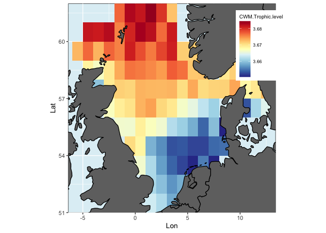<!-- -->

# 4. Statistically investigate trait-environment relationships

Here, we model with GAMS and random forest the trait responses at the community level (using CWM).


## 4.1 Preparation of the dataset

We want to model CWM from environmental data, so we need to merge these information in one data frame.


```r
# Merge FD with env data frame
# Because the rows of FD match the rows of env, we can combine them
FDenv<-cbind(FD,env)
head(FDenv)
```

```
##       nbsp sing.sp       FRic qual.FRic      FEve      FDiv     FDis     RaoQ
## 11448   53      53 0.11050248         1 0.4951084 0.4677279 1.153866 1.743521
## 11509   54      54 0.11938652         1 0.3689412 0.5084870 1.178385 1.777711
## 11510   58      58 0.28832932         1 0.3557629 0.4485747 1.201582 1.918632
## 11511   34      34 0.02316921         1 0.3993976 0.4578640 1.179618 1.855474
## 11570   49      49 0.02049308         1 0.3435861 0.6303350 1.192247 1.769948
## 11571   60      60 0.08082170         1 0.2997466 0.5208602 1.214820 1.950941
##       CWM.Trophic.level     CWM.K CWM.Lmax CWM.Lifespan CWM.Offspring.size
## 11448          3.672839 0.2208054 30.88649     19.32073          0.3261159
## 11509          3.668658 0.2280661 32.26489     19.23050          0.3211291
## 11510          3.676878 0.2276469 32.76946     19.25426          0.3541693
## 11511          3.681531 0.2219995 32.35330     19.40133          0.3142965
## 11570          3.659848 0.2345438 31.45960     18.97722          0.3024109
## 11571          3.666605 0.2304763 32.65263     19.25579          0.3474118
##       CWM.Fecundity CWM.Age.maturity  lon  lat     Depth      SBT      SBS
## 11448      11.21766         3.429492 -5.5 59.5 122.80000 9.389080 35.33215
## 11509      11.29733         3.394102 -4.5 58.5  86.57692 8.321193 35.11759
## 11510      11.22480         3.418214 -4.5 59.5 114.31481 9.209452 35.29067
## 11511      11.30216         3.443765 -4.5 60.5 162.25000 9.302133 35.34310
## 11570      11.30096         3.374244 -3.5 57.5  64.39394 8.663864 34.97061
## 11571      11.23999         3.411476 -3.5 58.5  79.67213 8.900358 35.08605
##             Chl  SBT_sea  Chl_sea   Fishing
## 11448 0.1918846 2.669061 2.790002 0.7410036
## 11509 0.5385093 4.569353 2.303008 0.2714596
## 11510 0.1959820 3.325120 2.361685 0.7997988
## 11511 0.0000000 1.903256 2.401930 1.1607867
## 11570 0.6294348 5.822665 3.103956 0.2468491
## 11571 0.6121088 5.245141 2.394388 0.3023233
```
## 4.2 Simple exploratory GAMs

We use the function `gam()` from the `mgcv package`. Please see the documentation `?gam` to inspect the function and all its options. 


We define a function to quickly plot GAM partial smooth plots and return summary statistics for the fitted model


```r
funGam<-function(Var){
  colnames(FDenv)[which(colnames(FDenv)==Var)]<-"Var"
  fit<-gam(Var~s(Depth, k=3)+s(SBT,k=3)+s(SBS,k=3)+s(Chl,k=3)+s(SBT_sea,k=3)+ s(Chl_sea, k=3)+s(Fishing, k=3), na.action=na.exclude, data=FDenv)
  par(mfrow=c(4,2),mar=c(4,4,0.2,0.2))
  plot(fit,shade=T,shade.col="grey",res=T,rug=F,pch=20,ylab="")
  par(mfrow=c(1,1),mar=c(5,4,2,2))
  return(summary(fit))
}
```

Now, let's try to model trophic level from environmental data 


```r
#Plot GAM partial smooth plots and return summary statistics for the fitted model
funGam(Metrics[9])
```

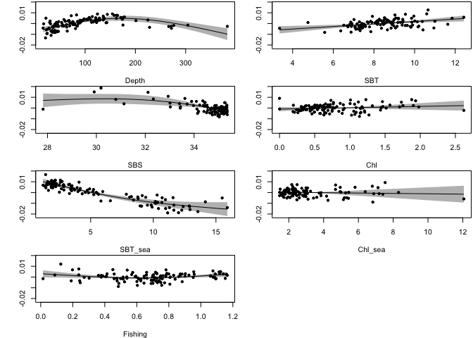<!-- -->

```
## 
## Family: gaussian 
## Link function: identity 
## 
## Formula:
## Var ~ s(Depth, k = 3) + s(SBT, k = 3) + s(SBS, k = 3) + s(Chl, 
##     k = 3) + s(SBT_sea, k = 3) + s(Chl_sea, k = 3) + s(Fishing, 
##     k = 3)
## 
## Parametric coefficients:
##             Estimate Std. Error t value Pr(>|t|)    
## (Intercept) 3.668518   0.000341   10758   <2e-16 ***
## ---
## Signif. codes:  0 '***' 0.001 '**' 0.01 '*' 0.05 '.' 0.1 ' ' 1
## 
## Approximate significance of smooth terms:
##              edf Ref.df      F  p-value    
## s(Depth)   1.947  1.997 15.213 3.32e-06 ***
## s(SBT)     1.000  1.000 12.135 0.000736 ***
## s(SBS)     1.824  1.968  6.756 0.001337 ** 
## s(Chl)     1.000  1.000  0.943 0.333947    
## s(SBT_sea) 1.802  1.960 29.113  < 2e-16 ***
## s(Chl_sea) 1.000  1.000  0.147 0.701813    
## s(Fishing) 1.879  1.984  4.436 0.017152 *  
## ---
## Signif. codes:  0 '***' 0.001 '**' 0.01 '*' 0.05 '.' 0.1 ' ' 1
## 
## R-sq.(adj) =  0.836   Deviance explained = 85.2%
## GCV = 1.4392e-05  Scale est. = 1.2907e-05  n = 111
```

## 4.3 Detailed and thorough model selection

## 4.3.1 Considering potential spatial autocorrelation

Here we use a mixed GAM approach taking into account potential spatial autocorrelation (by allowing for correlated error structures)
We use the function `uGamm()` from the `MuMIn package` which is a wrapper function for gamm. Please see the documentation `?uGamm` to inspect the function and all its options. 


```r
# Create dummy variable to include as random factor
dummy <- rep(1, dim(FDenv)[1]) ### Dummy variables to be add as random factor (mandatory, but won't 'change' anything)

# Trophic level as an example
# Check distribution of response
hist(FDenv$CWM.Trophic.level) 
```

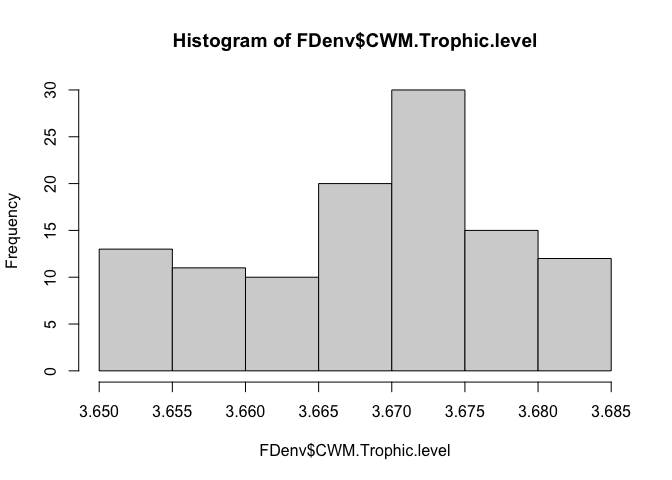<!-- -->

```r
# Consider log transforming or change family statement in gam in case of strong deviations from normal distribution 
```


```r
fitTL <- uGamm(CWM.Trophic.level ~ s(Depth, k=3)
                   +s(SBT,k=3)
                   +s(SBS,k=3)
                   +s(Chl,k=3)
                   +s(SBT_sea,k=3)
                   +s(Chl_sea, k=3)
                   +s(Fishing, k=3),
                   gaussian(link = "identity"),random = list(dummy=~1), correlation = corGaus(form = ~ lon+lat), # Can try other error structures
                   data = FDenv, control=lmeControl(opt="optim"))
# Inspect summary statistics
summary(fitTL$lme)
```

```
## Linear mixed-effects model fit by maximum likelihood
##  Data: strip.offset(mf) 
##         AIC       BIC   logLik
##   -934.5227 -885.7511 485.2613
## 
## Random effects:
##  Formula: ~Xr - 1 | g
##                 Xr
## StdDev: 0.05283078
## 
##  Formula: ~Xr.0 - 1 | g.0 %in% g
##               Xr.0
## StdDev: 0.02918169
## 
##  Formula: ~Xr.1 - 1 | g.1 %in% g.0 %in% g
##              Xr.1
## StdDev: 0.0835984
## 
##  Formula: ~Xr.2 - 1 | g.2 %in% g.1 %in% g.0 %in% g
##                Xr.2
## StdDev: 0.000208067
## 
##  Formula: ~Xr.3 - 1 | g.3 %in% g.2 %in% g.1 %in% g.0 %in% g
##               Xr.3
## StdDev: 0.01552293
## 
##  Formula: ~Xr.4 - 1 | g.4 %in% g.3 %in% g.2 %in% g.1 %in% g.0 %in% g
##                 Xr.4
## StdDev: 0.0007529327
## 
##  Formula: ~Xr.5 - 1 | g.5 %in% g.4 %in% g.3 %in% g.2 %in% g.1 %in% g.0 %in% g
##               Xr.5
## StdDev: 0.01315406
## 
##  Formula: ~1 | dummy %in% g.5 %in% g.4 %in% g.3 %in% g.2 %in% g.1 %in% g.0 %in% g
##          (Intercept)    Residual
## StdDev: 1.603374e-05 0.004238982
## 
## Correlation Structure: Gaussian spatial correlation
##  Formula: ~lon + lat | g/g.0/g.1/g.2/g.3/g.4/g.5/dummy 
##  Parameter estimate(s):
##    range 
## 1.285329 
## Fixed effects: y ~ X - 1 
##                    Value    Std.Error  DF  t-value p-value
## X(Intercept)    3.668357 0.0008402284 103 4365.905  0.0000
## Xs(Depth)Fx1   -0.001009 0.0007105318 103   -1.419  0.1588
## Xs(SBT)Fx1     -0.002223 0.0004525763 103   -4.912  0.0000
## Xs(SBS)Fx1      0.000897 0.0007288244 103    1.231  0.2212
## Xs(Chl)Fx1      0.000570 0.0006103333 103    0.934  0.3527
## Xs(SBT_sea)Fx1  0.003951 0.0014800878 103    2.669  0.0088
## Xs(Chl_sea)Fx1 -0.000369 0.0008581685 103   -0.429  0.6685
## Xs(Fishing)Fx1 -0.000341 0.0004113258 103   -0.828  0.4094
##  Correlation: 
##                X(Int) X(D)F1 X(SBT) X(SBS) X(C)F1 X(SBT_ X(C_)F
## Xs(Depth)Fx1    0.056                                          
## Xs(SBT)Fx1      0.029  0.002                                   
## Xs(SBS)Fx1     -0.070  0.037  0.189                            
## Xs(Chl)Fx1     -0.001  0.041 -0.084 -0.102                     
## Xs(SBT_sea)Fx1 -0.015  0.591 -0.073  0.434  0.140              
## Xs(Chl_sea)Fx1  0.066 -0.093  0.182  0.295 -0.559 -0.252       
## Xs(Fishing)Fx1 -0.036 -0.097 -0.054 -0.102 -0.155 -0.153  0.276
## 
## Standardized Within-Group Residuals:
##        Min         Q1        Med         Q3        Max 
## -2.5792923 -0.4872585  0.2706609  0.8124242  1.9636879 
## 
## Number of Observations: 111
## Number of Groups: 
##                                                                  g 
##                                                                  1 
##                                                         g.0 %in% g 
##                                                                  1 
##                                                g.1 %in% g.0 %in% g 
##                                                                  1 
##                                       g.2 %in% g.1 %in% g.0 %in% g 
##                                                                  1 
##                              g.3 %in% g.2 %in% g.1 %in% g.0 %in% g 
##                                                                  1 
##                     g.4 %in% g.3 %in% g.2 %in% g.1 %in% g.0 %in% g 
##                                                                  1 
##            g.5 %in% g.4 %in% g.3 %in% g.2 %in% g.1 %in% g.0 %in% g 
##                                                                  1 
## dummy %in% g.5 %in% g.4 %in% g.3 %in% g.2 %in% g.1 %in% g.0 %in% g 
##                                                                  1
```

```r
summary(fitTL$gam)
```

```
## 
## Family: gaussian 
## Link function: identity 
## 
## Formula:
## CWM.Trophic.level ~ s(Depth, k = 3) + s(SBT, k = 3) + s(SBS, 
##     k = 3) + s(Chl, k = 3) + s(SBT_sea, k = 3) + s(Chl_sea, k = 3) + 
##     s(Fishing, k = 3)
## 
## Parametric coefficients:
##              Estimate Std. Error t value Pr(>|t|)    
## (Intercept) 3.6683574  0.0008131    4512   <2e-16 ***
## ---
## Signif. codes:  0 '***' 0.001 '**' 0.01 '*' 0.05 '.' 0.1 ' ' 1
## 
## Approximate significance of smooth terms:
##              edf Ref.df      F  p-value    
## s(Depth)   1.946  1.946 10.772 0.000509 ***
## s(SBT)     1.880  1.880 10.896 5.62e-05 ***
## s(SBS)     1.917  1.917  6.874 0.008064 ** 
## s(Chl)     1.000  1.000  0.931 0.337069    
## s(SBT_sea) 1.594  1.594  8.405 0.012103 *  
## s(Chl_sea) 1.002  1.002  0.198 0.658849    
## s(Fishing) 1.911  1.911  4.922 0.007910 ** 
## ---
## Signif. codes:  0 '***' 0.001 '**' 0.01 '*' 0.05 '.' 0.1 ' ' 1
## 
## R-sq.(adj) =  0.698   
##   Scale est. = 1.7969e-05  n = 111
```


```r
# Check diagnostics
par(mfrow=c(2,2))
gam.check(fitTL$gam)
```

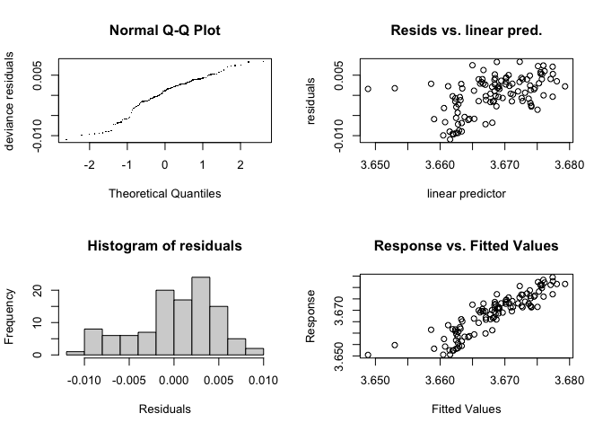<!-- -->

```
## 
## 'gamm' based fit - care required with interpretation.
## Checks based on working residuals may be misleading.
## Basis dimension (k) checking results. Low p-value (k-index<1) may
## indicate that k is too low, especially if edf is close to k'.
## 
##              k'  edf k-index p-value    
## s(Depth)   2.00 1.95    0.54  <2e-16 ***
## s(SBT)     2.00 1.88    0.98    0.38    
## s(SBS)     2.00 1.92    0.50  <2e-16 ***
## s(Chl)     2.00 1.00    1.11    0.84    
## s(SBT_sea) 2.00 1.59    0.63  <2e-16 ***
## s(Chl_sea) 2.00 1.00    0.77    0.01 ** 
## s(Fishing) 2.00 1.91    0.89    0.11    
## ---
## Signif. codes:  0 '***' 0.001 '**' 0.01 '*' 0.05 '.' 0.1 ' ' 1
```


```r
par(mfrow=c(4,2),mar=c(4,4,0.2,0.2))
plot(fitTL$gam,shade=T,shade.col="grey",res=T,rug=F,pch=20)
par(mfrow=c(1,1),mar=c(5,4,2,2))
```

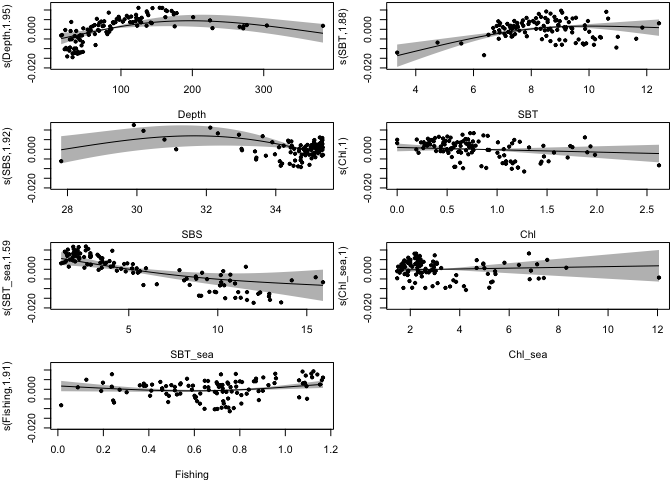<!-- -->

## 4.3.2 Automated model selection

Here, we perform automated model selection testing all combinations of predictors using the `dredge()` function (and rank according to AICc)
Please see the documentation `?dredge` from the `MuMIn package` to inspect the function and all its options.

**Be aware, the computation of `FD` can take several minutes.**

```r
results <- dredge(fitTL, m.lim=c(1,4), rank="AICc") # Here test max 4 variables per model to reduce run time
```

```
## Fixed term is "(Intercept)"
```

```r
subset(results, delta <5)  # Depth, SBT and fishing are key variables
```

```
## Global model call: uGamm(formula = CWM.Trophic.level ~ s(Depth, k = 3) + s(SBT, 
##     k = 3) + s(SBS, k = 3) + s(Chl, k = 3) + s(SBT_sea, k = 3) + 
##     s(Chl_sea, k = 3) + s(Fishing, k = 3), random = list(dummy = ~1), 
##     gaussian(link = "identity"), correlation = corGaus(form = ~lon + 
##         lat), data = FDenv, control = lmeControl(opt = "optim"))
## ---
## Model selection table 
##     (Int) s(Chl_sea,3) s(Chl,3) s(Dpt,3) s(Fsh,3) s(SBS,3) s(SBT_sea,3)
## 77  3.668                              +        +                      
## 69  3.669                              +                               
## 117 3.668                              +                 +            +
## 93  3.668                              +        +        +             
## 109 3.668                              +        +                     +
## 101 3.669                              +                              +
## 79  3.668                     +        +        +                      
## 85  3.668                              +                 +             
## 78  3.668            +                 +        +                      
##     s(SBT,3) df  logLik   AICc delta weight
## 77         + 10 479.832 -937.5  0.00  0.365
## 69         +  8 476.451 -935.5  1.97  0.136
## 117        + 12 481.124 -935.1  2.40  0.110
## 93         + 12 481.109 -935.0  2.43  0.108
## 109        + 12 480.962 -934.7  2.72  0.093
## 101        + 10 478.220 -934.2  3.22  0.073
## 79         + 12 480.401 -933.6  3.85  0.053
## 85         + 10 477.375 -932.5  4.91  0.031
## 78         + 12 479.860 -932.5  4.93  0.031
## Models ranked by AICc(x)
```

```r
# Calculate and view relative variable importance (RVI) scores
importance(results) 
```

```
##                      s(SBT, k = 3) s(Depth, k = 3) s(Fishing, k = 3)
## Sum of weights:      1.00          1.00            0.61             
## N containing models:   42            42              42             
##                      s(SBT_sea, k = 3) s(SBS, k = 3) s(Chl, k = 3)
## Sum of weights:      0.28              0.24          0.09         
## N containing models:   42                42            42         
##                      s(Chl_sea, k = 3)
## Sum of weights:      0.05             
## N containing models:   42
```


```r
# Fit and inspect the "best" model
fitTLb <- uGamm(CWM.Trophic.level ~ s(Depth, k=3)
               +s(SBT,k=3),
               #+s(Fishing, k=3),
               gaussian(link = "identity"),random = list(dummy=~1), correlation = corGaus(form = ~ lon+lat), # Can try other error structures
               data = FDenv, control=lmeControl(opt="optim"))
```


```r
# Inspect summary statistics
summary(fitTLb$lme)
```

```
## Linear mixed-effects model fit by maximum likelihood
##  Data: strip.offset(mf) 
##         AIC       BIC   logLik
##   -936.9015 -915.2253 476.4507
## 
## Random effects:
##  Formula: ~Xr - 1 | g
##                 Xr
## StdDev: 0.07179893
## 
##  Formula: ~Xr.0 - 1 | g.0 %in% g
##               Xr.0
## StdDev: 0.02144612
## 
##  Formula: ~1 | dummy %in% g.0 %in% g
##          (Intercept)   Residual
## StdDev: 5.358381e-05 0.00482721
## 
## Correlation Structure: Gaussian spatial correlation
##  Formula: ~lon + lat | g/g.0/dummy 
##  Parameter estimate(s):
##    range 
## 1.302305 
## Fixed effects: y ~ X - 1 
##                  Value    Std.Error  DF  t-value p-value
## X(Intercept)  3.668507 0.0009297166 108 3945.833   0e+00
## Xs(Depth)Fx1 -0.002240 0.0005321247 108   -4.210   1e-04
## Xs(SBT)Fx1   -0.001779 0.0004450213 108   -3.999   1e-04
##  Correlation: 
##              X(Int) X(D)F1
## Xs(Depth)Fx1 0.033        
## Xs(SBT)Fx1   0.020  0.260 
## 
## Standardized Within-Group Residuals:
##        Min         Q1        Med         Q3        Max 
## -2.8254600 -0.6198796  0.1465720  0.8959802  1.8463856 
## 
## Number of Observations: 111
## Number of Groups: 
##                     g            g.0 %in% g dummy %in% g.0 %in% g 
##                     1                     1                     1
```

```r
summary(fitTLb$gam)
```

```
## 
## Family: gaussian 
## Link function: identity 
## 
## Formula:
## CWM.Trophic.level ~ s(Depth, k = 3) + s(SBT, k = 3)
## 
## Parametric coefficients:
##              Estimate Std. Error t value Pr(>|t|)    
## (Intercept) 3.6685067  0.0009212    3982   <2e-16 ***
## ---
## Signif. codes:  0 '***' 0.001 '**' 0.01 '*' 0.05 '.' 0.1 ' ' 1
## 
## Approximate significance of smooth terms:
##            edf Ref.df      F p-value    
## s(Depth) 1.982  1.982 37.554 < 2e-16 ***
## s(SBT)   1.812  1.812  6.339 0.00196 ** 
## ---
## Signif. codes:  0 '***' 0.001 '**' 0.01 '*' 0.05 '.' 0.1 ' ' 1
## 
## R-sq.(adj) =  0.589   
##   Scale est. = 2.3302e-05  n = 111
```


```r
# Check diagnostics
par(mfrow=c(2,2))
gam.check(fitTLb$gam)
```

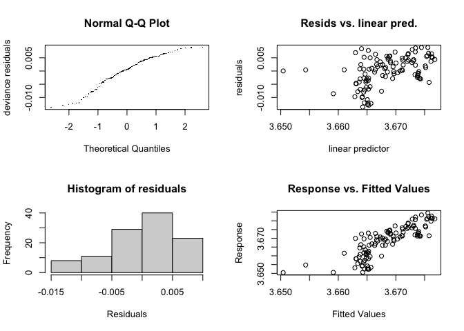<!-- -->

```
## 
## 'gamm' based fit - care required with interpretation.
## Checks based on working residuals may be misleading.
## Basis dimension (k) checking results. Low p-value (k-index<1) may
## indicate that k is too low, especially if edf is close to k'.
## 
##            k'  edf k-index p-value    
## s(Depth) 2.00 1.98    0.49  <2e-16 ***
## s(SBT)   2.00 1.81    1.01    0.56    
## ---
## Signif. codes:  0 '***' 0.001 '**' 0.01 '*' 0.05 '.' 0.1 ' ' 1
```


```r
# Plot model smooth terms
par(mfrow=c(2,1),mar=c(4,4,0.2,0.2))
plot(fitTLb$gam,shade=T,shade.col="grey",res=T,rug=F,pch=20)
```

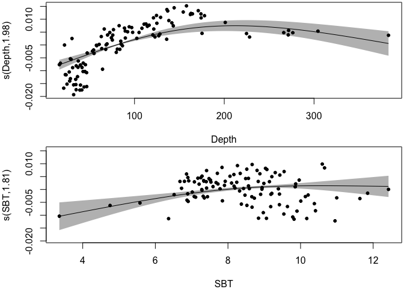<!-- -->


#5. Random forest

Instead of GAM, we can try to model the CWM trait with random forest. 
We use the function `randomForest()` from the `randomForest package`. Please see the documentation `?randomForest` to inspect the function and all its options. 

Again we create a function to simply compute random forests

```r
# Wrapper function to explore RF for a given trait
funRf<-function(Var){
  colnames(FDenv)[which(colnames(FDenv)==Var)]<-"Var"
  fit<-randomForest(Var~Depth+SBT+SBS+Chl+SBT_sea+Chl_sea+Fishing, data=FDenv,ntree=1000,importance=T, mtry=2)
  par(mfrow=c(4,2),mar=c(4,4,0.2,0.2))
  partialPlot(fit, x.var=Depth,FDenv,main="")
  partialPlot(fit, x.var=SBT,FDenv,main="")
  partialPlot(fit, x.var=SBS,FDenv,main="")
  partialPlot(fit, x.var=Chl,FDenv,main="")
  partialPlot(fit, x.var=SBT_sea,FDenv,main="")
  partialPlot(fit, x.var=Chl_sea,FDenv,main="")
  partialPlot(fit, x.var=Fishing,FDenv,main="")
  par(mfrow=c(1,1),mar=c(5,4,2,2))
  return(fit)
}
```

Now, we compute the randomForest for CWM trophic level.

```r
fitTLrf <- funRf(Metrics[9])# Plot random forest response plots and summary stats
```

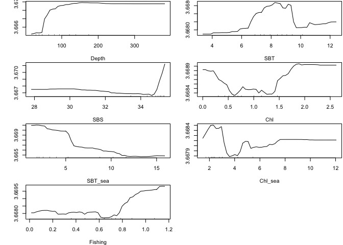<!-- -->

### Check error against number of trees used for training

```r
plot(fitTLrf) 
```

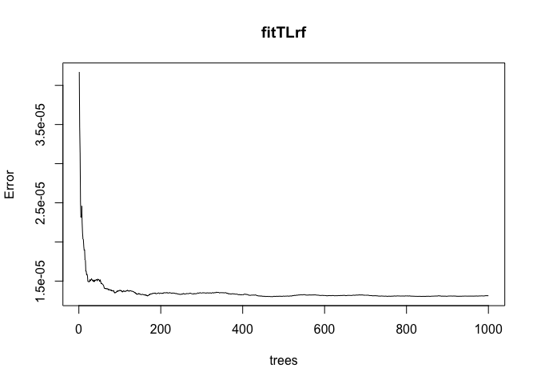<!-- -->
It is stable after 200 (hence 100 trees is more than enough).

### Inspect summary stats

```r
print(fitTLrf) # Inspect summary stats
```

```
## 
## Call:
##  randomForest(formula = Var ~ Depth + SBT + SBS + Chl + SBT_sea +      Chl_sea + Fishing, data = FDenv, ntree = 1000, importance = T,      mtry = 2) 
##                Type of random forest: regression
##                      Number of trees: 1000
## No. of variables tried at each split: 2
## 
##           Mean of squared residuals: 1.312737e-05
##                     % Var explained: 83.17
```

### Check variable importance plots


```r
varImpPlot(fitTLrf)
```

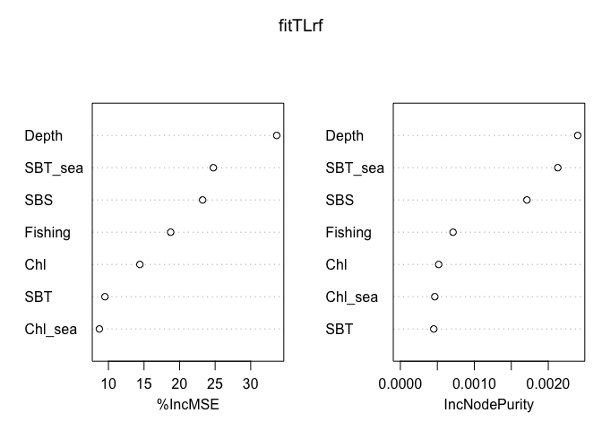<!-- -->


# Conclusion 

# References

# Optional - GLMM

We test GLMM and extract parameters to facilitate comparisons across organism groups and areas. 

Please note that you may need to introduce square terms to account for non-linearities.

Additionnally, you need to load the package `nlme`.


```r
library(nlme)
fitTLglm <- lme(CWM.Trophic.level~Depth+SBT+SBS+Chl+SBT_sea+Chl_sea+Fishing,
                random = list(dummy=~1), correlation = corGaus(form = ~ lon+lat), # Can try other error structures
                data = FDenv, control=lmeControl(opt="optim"))
summary(fitTLglm)
```

```
## Linear mixed-effects model fit by REML
##  Data: FDenv 
##         AIC       BIC   logLik
##   -806.9263 -777.9442 414.4631
## 
## Random effects:
##  Formula: ~1 | dummy
##         (Intercept)    Residual
## StdDev: 0.001283906 0.005072547
## 
## Correlation Structure: Gaussian spatial correlation
##  Formula: ~lon + lat | dummy 
##  Parameter estimate(s):
##    range 
## 1.236899 
## Fixed effects: CWM.Trophic.level ~ Depth + SBT + SBS + Chl + SBT_sea + Chl_sea +      Fishing 
##                 Value   Std.Error  DF   t-value p-value
## (Intercept)  3.658215 0.023500204 103 155.66736  0.0000
## Depth       -0.000001 0.000010245 103  -0.13052  0.8964
## SBT          0.001369 0.000366536 103   3.73545  0.0003
## SBS          0.000135 0.000628198 103   0.21542  0.8299
## Chl         -0.003138 0.001465780 103  -2.14079  0.0347
## SBT_sea     -0.001323 0.000273592 103  -4.83515  0.0000
## Chl_sea      0.000783 0.000527384 103   1.48405  0.1408
## Fishing      0.002836 0.001885392 103   1.50412  0.1356
##  Correlation: 
##         (Intr) Depth  SBT    SBS    Chl    SBT_se Chl_se
## Depth   -0.123                                          
## SBT     -0.269  0.085                                   
## SBS     -0.983  0.039  0.155                            
## Chl      0.169  0.013 -0.177 -0.166                     
## SBT_sea -0.394  0.525 -0.187  0.370  0.003              
## Chl_sea -0.419 -0.080  0.214  0.378 -0.519 -0.240       
## Fishing -0.014  0.042 -0.065 -0.055 -0.105  0.107  0.229
## 
## Standardized Within-Group Residuals:
##        Min         Q1        Med         Q3        Max 
## -2.5175634 -0.6033540  0.1121980  0.5928751  2.2935525 
## 
## Number of Observations: 111
## Number of Groups: 1
```

```r
anova(fitTLglm)
```

```
##             numDF denDF F-value p-value
## (Intercept)     1   103 5398195  <.0001
## Depth           1   103      14  0.0003
## SBT             1   103       5  0.0250
## SBS             1   103      12  0.0008
## Chl             1   103       6  0.0185
## SBT_sea         1   103      24  <.0001
## Chl_sea         1   103       1  0.2446
## Fishing         1   103       2  0.1356
```

```r
# Extract parameters
str(summary(fitTLglm))
```

```
## List of 22
##  $ modelStruct :List of 2
##   ..$ reStruct :List of 1
##   .. ..$ dummy: 'pdLogChol' num 0.0641
##   .. .. ..- attr(*, "formula")=Class 'formula'  language ~1
##   .. .. .. .. ..- attr(*, ".Environment")=<environment: R_GlobalEnv> 
##   .. .. ..- attr(*, "Dimnames")=List of 2
##   .. .. .. ..$ : chr "(Intercept)"
##   .. .. .. ..$ : chr "(Intercept)"
##   .. ..- attr(*, "settings")= int [1:4] 1 1 0 4
##   .. ..- attr(*, "class")= chr "reStruct"
##   .. ..- attr(*, "plen")= Named int 1
##   .. .. ..- attr(*, "names")= chr "dummy"
##   ..$ corStruct: 'corGaus' num 0.213
##   .. ..- attr(*, "formula")=Class 'formula'  language ~lon + lat | dummy
##   .. .. .. ..- attr(*, ".Environment")=<environment: 0x7f9e4e70aea8> 
##   .. ..- attr(*, "nugget")= logi FALSE
##   .. ..- attr(*, "metric")= chr "euclidean"
##   .. ..- attr(*, "fixed")= logi FALSE
##   .. ..- attr(*, "groups")= Factor w/ 1 level "1": 1 1 1 1 1 1 1 1 1 1 ...
##   .. ..- attr(*, "Dim")=List of 6
##   .. .. ..$ N       : int 111
##   .. .. ..$ M       : int 1
##   .. .. ..$ spClass : int 3
##   .. .. ..$ sumLenSq: num 12321
##   .. .. ..$ len     : 'table' int [1(1d)] 111
##   .. .. .. ..- attr(*, "dimnames")=List of 1
##   .. .. .. .. ..$ groups: chr "1"
##   .. .. ..$ start   : Named num 0
##   .. .. .. ..- attr(*, "names")= chr ""
##   .. ..- attr(*, "covariate")=List of 1
##   .. .. ..$ 1: num [1:6105] 1.41 1 1.41 2.83 2.24 ...
##   .. ..- attr(*, "minD")= num 1
##   .. ..- attr(*, "factor")= num [1:12321] 1.00 -2.81e-01 -5.40e-01 -6.75e-17 2.08e-02 ...
##   .. ..- attr(*, "logDet")= num -37.3
##   ..- attr(*, "settings")= int [1:4] 1 1 0 4
##   ..- attr(*, "class")= chr [1:2] "lmeStruct" "modelStruct"
##   ..- attr(*, "pmap")= logi [1:2, 1:2] TRUE FALSE FALSE TRUE
##   .. ..- attr(*, "dimnames")=List of 2
##   .. .. ..$ : NULL
##   .. .. ..$ : chr [1:2] "reStruct" "corStruct"
##   ..- attr(*, "fixedSigma")= logi FALSE
##  $ dims        :List of 5
##   ..$ N    : int 111
##   ..$ Q    : int 1
##   ..$ qvec : Named num [1:3] 1 0 0
##   .. ..- attr(*, "names")= chr [1:3] "dummy" "" ""
##   ..$ ngrps: Named int [1:3] 1 1 1
##   .. ..- attr(*, "names")= chr [1:3] "dummy" "X" "y"
##   ..$ ncol : Named num [1:3] 1 8 1
##   .. ..- attr(*, "names")= chr [1:3] "dummy" "" ""
##  $ contrasts   : Named list()
##  $ coefficients:List of 2
##   ..$ fixed : Named num [1:8] 3.66 -1.34e-06 1.37e-03 1.35e-04 -3.14e-03 ...
##   .. ..- attr(*, "names")= chr [1:8] "(Intercept)" "Depth" "SBT" "SBS" ...
##   ..$ random:List of 1
##   .. ..$ dummy: num [1, 1] -2.16e-15
##   .. .. ..- attr(*, "dimnames")=List of 2
##   .. .. .. ..$ : chr "1"
##   .. .. .. ..$ : chr "(Intercept)"
##  $ varFix      : num [1:8, 1:8] 5.52e-04 -2.97e-08 -2.32e-06 -1.45e-05 5.81e-06 ...
##   ..- attr(*, "dimnames")=List of 2
##   .. ..$ : chr [1:8] "(Intercept)" "Depth" "SBT" "SBS" ...
##   .. ..$ : chr [1:8] "(Intercept)" "Depth" "SBT" "SBS" ...
##  $ sigma       : num 0.00507
##  $ apVar       : chr "Non-positive definite approximate variance-covariance"
##  $ logLik      : num 414
##  $ numIter     : NULL
##  $ groups      :'data.frame':	111 obs. of  1 variable:
##   ..$ dummy: Factor w/ 1 level "1": 1 1 1 1 1 1 1 1 1 1 ...
##  $ call        : language lme.formula(fixed = CWM.Trophic.level ~ Depth + SBT + SBS + Chl + SBT_sea +      Chl_sea + Fishing, data = FDenv,| __truncated__ ...
##  $ terms       :Classes 'terms', 'formula'  language CWM.Trophic.level ~ Depth + SBT + SBS + Chl + SBT_sea + Chl_sea + Fishing
##   .. ..- attr(*, "variables")= language list(CWM.Trophic.level, Depth, SBT, SBS, Chl, SBT_sea, Chl_sea, Fishing)
##   .. ..- attr(*, "factors")= int [1:8, 1:7] 0 1 0 0 0 0 0 0 0 0 ...
##   .. .. ..- attr(*, "dimnames")=List of 2
##   .. .. .. ..$ : chr [1:8] "CWM.Trophic.level" "Depth" "SBT" "SBS" ...
##   .. .. .. ..$ : chr [1:7] "Depth" "SBT" "SBS" "Chl" ...
##   .. ..- attr(*, "term.labels")= chr [1:7] "Depth" "SBT" "SBS" "Chl" ...
##   .. ..- attr(*, "order")= int [1:7] 1 1 1 1 1 1 1
##   .. ..- attr(*, "intercept")= int 1
##   .. ..- attr(*, "response")= int 1
##   .. ..- attr(*, ".Environment")=<environment: R_GlobalEnv> 
##   .. ..- attr(*, "predvars")= language list(CWM.Trophic.level, Depth, SBT, SBS, Chl, SBT_sea, Chl_sea, Fishing)
##   .. ..- attr(*, "dataClasses")= Named chr [1:8] "numeric" "numeric" "numeric" "numeric" ...
##   .. .. ..- attr(*, "names")= chr [1:8] "CWM.Trophic.level" "Depth" "SBT" "SBS" ...
##  $ method      : chr "REML"
##  $ fitted      : num [1:111, 1:2] 3.68 3.67 3.67 3.68 3.67 ...
##   ..- attr(*, "dimnames")=List of 2
##   .. ..$ : chr [1:111] "11448" "11509" "11510" "11511" ...
##   .. ..$ : chr [1:2] "fixed" "dummy"
##  $ residuals   : Named num [1:5] -2.518 -0.603 0.112 0.593 2.294
##   ..- attr(*, "names")= chr [1:5] "Min" "Q1" "Med" "Q3" ...
##  $ fixDF       :List of 2
##   ..$ X    : Named num [1:8] 103 103 103 103 103 103 103 103
##   .. ..- attr(*, "names")= chr [1:8] "(Intercept)" "Depth" "SBT" "SBS" ...
##   ..$ terms: Named num [1:8] 103 103 103 103 103 103 103 103
##   .. ..- attr(*, "names")= chr [1:8] "(Intercept)" "Depth" "SBT" "SBS" ...
##   ..- attr(*, "assign")=List of 8
##   .. ..$ (Intercept): int 1
##   .. ..$ Depth      : int 2
##   .. ..$ SBT        : int 3
##   .. ..$ SBS        : int 4
##   .. ..$ Chl        : int 5
##   .. ..$ SBT_sea    : int 6
##   .. ..$ Chl_sea    : int 7
##   .. ..$ Fishing    : int 8
##   ..- attr(*, "varFixFact")= num [1:8, 1:8] -0.001579 0.000776 0.00317 0.016455 -0.003318 ...
##  $ na.action   : NULL
##  $ data        :'data.frame':	111 obs. of  24 variables:
##   ..$ nbsp              : int [1:111] 53 54 58 34 49 60 58 40 62 48 ...
##   ..$ sing.sp           : num [1:111] 53 54 58 34 49 60 58 40 62 48 ...
##   ..$ FRic              : num [1:111] 0.1105 0.1194 0.2883 0.0232 0.0205 ...
##   ..$ qual.FRic         : num [1:111] 1 1 1 1 1 1 1 1 1 1 ...
##   ..$ FEve              : num [1:111] 0.495 0.369 0.356 0.399 0.344 ...
##   ..$ FDiv              : num [1:111] 0.468 0.508 0.449 0.458 0.63 ...
##   ..$ FDis              : num [1:111] 1.15 1.18 1.2 1.18 1.19 ...
##   ..$ RaoQ              : num [1:111] 1.74 1.78 1.92 1.86 1.77 ...
##   ..$ CWM.Trophic.level : num [1:111] 3.67 3.67 3.68 3.68 3.66 ...
##   ..$ CWM.K             : num [1:111] 0.221 0.228 0.228 0.222 0.235 ...
##   ..$ CWM.Lmax          : num [1:111] 30.9 32.3 32.8 32.4 31.5 ...
##   ..$ CWM.Lifespan      : num [1:111] 19.3 19.2 19.3 19.4 19 ...
##   ..$ CWM.Offspring.size: num [1:111] 0.326 0.321 0.354 0.314 0.302 ...
##   ..$ CWM.Fecundity     : num [1:111] 11.2 11.3 11.2 11.3 11.3 ...
##   ..$ CWM.Age.maturity  : num [1:111] 3.43 3.39 3.42 3.44 3.37 ...
##   ..$ lon               : num [1:111] -5.5 -4.5 -4.5 -4.5 -3.5 -3.5 -3.5 -3.5 -2.5 -2.5 ...
##   ..$ lat               : num [1:111] 59.5 58.5 59.5 60.5 57.5 58.5 59.5 60.5 56.5 57.5 ...
##   ..$ Depth             : num [1:111] 122.8 86.6 114.3 162.2 64.4 ...
##   ..$ SBT               : num [1:111] 9.39 8.32 9.21 9.3 8.66 ...
##   ..$ SBS               : num [1:111] 35.3 35.1 35.3 35.3 35 ...
##   ..$ Chl               : num [1:111] 0.192 0.539 0.196 0 0.629 ...
##   ..$ SBT_sea           : num [1:111] 2.67 4.57 3.33 1.9 5.82 ...
##   ..$ Chl_sea           : num [1:111] 2.79 2.3 2.36 2.4 3.1 ...
##   ..$ Fishing           : num [1:111] 0.741 0.271 0.8 1.161 0.247 ...
##  $ corFixed    : num [1:8, 1:8] 1 -0.123 -0.269 -0.983 0.169 ...
##   ..- attr(*, "dimnames")=List of 2
##   .. ..$ : chr [1:8] "(Intercept)" "Depth" "SBT" "SBS" ...
##   .. ..$ : chr [1:8] "(Intercept)" "Depth" "SBT" "SBS" ...
##  $ tTable      : num [1:8, 1:5] 3.66 -1.34e-06 1.37e-03 1.35e-04 -3.14e-03 ...
##   ..- attr(*, "dimnames")=List of 2
##   .. ..$ : chr [1:8] "(Intercept)" "Depth" "SBT" "SBS" ...
##   .. ..$ : chr [1:5] "Value" "Std.Error" "DF" "t-value" ...
##  $ BIC         : num -778
##  $ AIC         : num -807
##  - attr(*, "class")= chr [1:2] "summary.lme" "lme"
##  - attr(*, "verbose")= logi FALSE
##  - attr(*, "oClass")= chr "lme"
```

```r
summary(fitTLglm)$coefficients
```

```
## $fixed
##   (Intercept)         Depth           SBT           SBS           Chl 
##  3.658215e+00 -1.337148e-06  1.369179e-03  1.353262e-04 -3.137931e-03 
##       SBT_sea       Chl_sea       Fishing 
## -1.322860e-03  7.826655e-04  2.835853e-03 
## 
## $random
## $random$dummy
##     (Intercept)
## 1 -2.155731e-15
```

```r
##Plot some diagnostics
plot(fitTLglm)
```

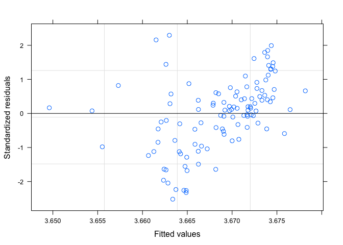<!-- -->

```r
qqnorm(residuals(fitTLglm))
```

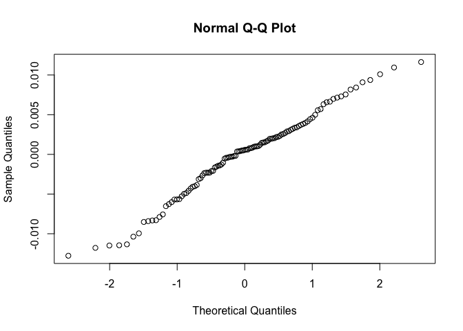<!-- -->

```r
#observed versus fitted values
plot(fitTLglm, CWM.Trophic.level~ fitted(.), abline = c(0,1))
```

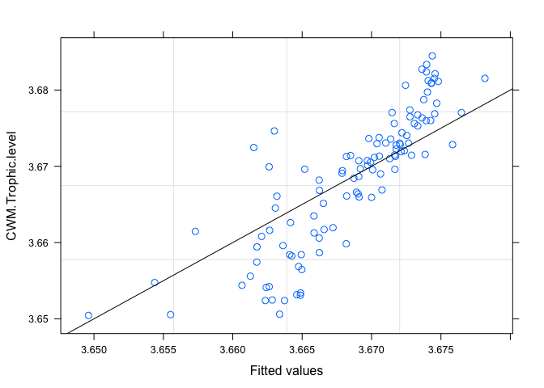<!-- -->

