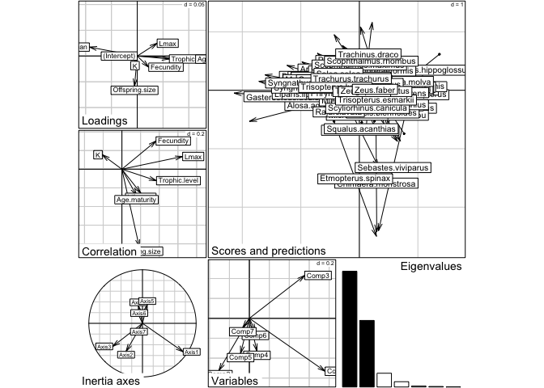
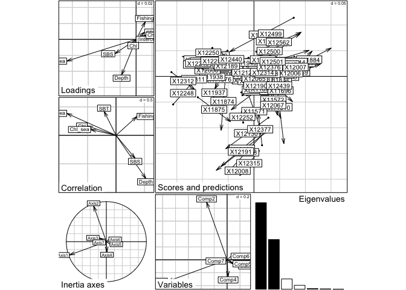

This document provides an introduction to Double Constrained Correspondance Analysis (DC-CA). The tutorial targets students and scientists in ecology with previous knowledge of the [R software](https://cran.r-project.org/). 

Please consult the [tutorial by ter Braak C.J.F. et al. 2016](https://ars.els-cdn.com/content/image/1-s2.0-S0048969720357004-mmc4.pdf) for more details about the double constrained correspondence analysis analysis [DOI 10.1016/j.scitotenv.2020.142171](https://doi.org/10.1016/j.scitotenv.2020.142171)

DC-CA is made of 6 steps:
step 1. CCA(Y ~ Env)


# 0. Preliminaries

## Load packages and dataset

The DC-CA analyses require the R packages [ade4 (v ≥ 1.7.16)](https://pbil.univ-lyon1.fr/ade4/home.php?lang=eng).


```r
library(ade4)
nrepet <- 999  # number of permutations in tests
adj_R2 <- function(R2_fraction, n, df){1-(1-R2_fraction)*(n-1)/(n-df-1)}
Align_axes <- function(Step2_wrRDA_SNC_on_Traits,Step3_CCA_on_traits,Step4_wRDA_CWM_on_Env){
  # Align the direction of the axes by comparing the canonical/regression coefficients
  #   already computed  in step 2 (Step2_wrRDA_SNC_on_Traits) 
  #   with those that follow from step 3  (Step3_CCA_on_traits) and step 4 (Step4_wRDA_CWM_on_Env)
  #
  #   From step 2 the canonical coefficients for traits are:
  C_traits <- Step2_wrRDA_SNC_on_Traits$fa[-1,] # with scaling alpha = 0
  # now compute the canonical coefficients for traits 
  # from steps 3 and 4 as in Appendix 2 of ter Braak, Dray, Smilauer 2018 Environmental and Ecological Statistics, 25, 171-197 
  
  B1 <- as.matrix(Step3_CCA_on_traits$fa[-1,])
  B_star <- as.matrix(Step4_wRDA_CWM_on_Env$c1)
  C_traits_check <- B1 %*%diag(1/sqrt(Step3_CCA_on_traits$eig)) %*% B_star %*% diag(sqrt(Step4_wRDA_CWM_on_Env$eig))
  #C_traits_check/C_traits #columns are either +1 or  -1
  flip <- diag(sign(C_traits_check[,1]/C_traits[1,]))
  flip.f <- function(X, flip){
    if (is.data.frame(X) && ncol(X)==nrow(flip) ) {
      XX <- as.data.frame(as.matrix(X)%*%flip)
      names(XX) <- names(X)
    } else XX <- X
    return(XX)
  }
  class_nam <- class(Step4_wRDA_CWM_on_Env)
  Step4_wRDA_CWM_on_Env <- lapply(Step4_wRDA_CWM_on_Env, flip.f, flip)
  class(Step4_wRDA_CWM_on_Env) <- class_nam
  return(Step4_wRDA_CWM_on_Env)
} #end Align_axes
```

If you want to plot a map with country border, then you also need the packages `maps (v ≥ 3.3)` and `mapdata (v ≥ 2.3)`.


```r
library(maps); library(mapdata)
```

If you get an error message, check that the R packages are installed correctly. If not, use the command: `install.packages(c("ade4", "maps", "mapdata"))`.

The example dataset is available as the Rdata file `NorthSea_FishTraitEnv.Rdata`, available for download [here](https://github.com/rfrelat/TraitEnvironment/raw/main/NorthSea_FishTraitEnv.Rdata).  

## Load the example dataset

Make sure the file `NorthSea_FishTraitEnv.Rdata` is in your working directory, then load it in R.


```r
load("NorthSea_FishTraitEnv.Rdata")
```

The Rdata file contains four objects: 
- `abu` containing the abundance of taxa in grid cells
- `env` containing the environmental condition per grid cell
- `trait` containing the trait information per taxa 
- `coo`: the coordinates of each grid cell

Importantly, the rows in `abu` correspond to the same grid cell than the rows in `env`, and the column in `abu` correspond to the same taxa than the rows in `trait`.  
If you want to learn how to create such dataset, see the short tutorial on setting trait-environement dataset in XXX.


```r
all(row.names(abu)==row.names(env))
```

```
## [1] TRUE
```

```r
all(colnames(abu)==row.names(trait))
```

```
## [1] TRUE
```

Using this fish community of the North Sea as an example, you will learn how to compute the RLQ analysis.

## Quick summary of the variables


```r
dim(trait)
```

```
## [1] 90  7
```

```r
names(trait)
```

```
## [1] "Trophic level"  "K"              "Lmax"           "Lifespan"      
## [5] "Offspring size" "Fecundity"      "Age maturity"
```

Seven traits for 90 taxa which are ...


```r
dim(env)
```

```
## [1] 111   7
```

```r
names(env)
```

```
## [1] "Depth"   "SBT"     "SBS"     "Chl"     "SBT_sea" "Chl_sea" "Fishing"
```

Seven environemental variables for 111 grid cells which are ...

# 1. CCA of the community table on to the environmental variables

step 1. CCA(Y ~ Env)


```r
CA_on_Abun <- ade4::dudi.coa(abu, scannf = F)
Step1_CCA_on_env <- ade4::pcaiv(CA_on_Abun, env, scannf = F, nf = ncol(env)) # CCA1
# Obtain from this analysis,
#           an m × q^* table of scores (S^* say) with q^* the rank of the environmental data,
S_star <- Step1_CCA_on_env$co
# By definition, S_star contains species-niche centroids 
#   with respect to orthonormalized environmental variables

dim(S_star) # species by environmental variables (mxq*) with q* = number of env. vars if env. vars are of full rank
```

```
## [1] 90  7
```

```r
q_star <- ncol(S_star)
```

# 2. an RDA of S^* on the trait variables using species weights 


```r
# step 2. Weighted RDA(S^*~Traits): 
#         an RDA of S^* on the trait variables,
#            using species weights K = colSums(Y) or K/sum(K),
#            given by Step1_CCA_on_env$cw
#
# Note that the total weighted variation analysed in this step
#  is equal to the sum of the CCA eigenvalues in step 1
abs(sum(S_star^2 * Step1_CCA_on_env$cw) - sum(Step1_CCA_on_env$eig)) < 1.e-12
```

```
## [1] TRUE
```

```r
#
# weighted RDA(S^*~Traits)  in ade4:
pca_S_star <- ade4::dudi.pca(S_star, row.w = Step1_CCA_on_env$cw, scale = FALSE, scannf = FALSE, nf = ncol(S_star))
Step2_wrRDA_SNC_on_Traits <- ade4::pcaiv(pca_S_star, trait, scannf = FALSE, nf = ncol(trait)) 
#

# It is of interest to express these eigenvalues
# as fraction of the environmentally structured variation
# which was obtained in step 1 
# The fraction of environmentally structured variation 
#  explained by the traits is 
R2_Env_variation_explained_by_Traits <- sum(Step2_wrRDA_SNC_on_Traits$eig)/sum(Step1_CCA_on_env$eig)
# per axis
Fraction_env_structured_variation_explained_by_traits <- cumsum(Step2_wrRDA_SNC_on_Traits$eig)/sum(Step1_CCA_on_env$eig) # 
names_axes <- paste("Axis",seq_along(Step2_wrRDA_SNC_on_Traits$eig))
names(Fraction_env_structured_variation_explained_by_traits)<- names_axes

# Species-level significance test
Species_level_test <- randtest(Step2_wrRDA_SNC_on_Traits, nrepet = nrepet)
Species_level_test
```

```
## Monte-Carlo test
## Call: randtest.pcaiv(xtest = Step2_wrRDA_SNC_on_Traits, nrepet = nrepet)
## 
## Observation: 0.09805588 
## 
## Based on 999 replicates
## Simulated p-value: 0.324 
## Alternative hypothesis: greater 
## 
##      Std.Obs  Expectation     Variance 
## 0.3587088911 0.0867200364 0.0009986732
```

```r
p_value_species_level_test <- Species_level_test$pvalue
```


# 3 CCA of the transposed community table on to the traits


```r
# step 3. CCA(t(Y) ~Traits): 
#         a CCA of the transposed community table on to the traits
#

# the standard way of doing a CCA in ade4: 
CA_on_Abun.t <- ade4::dudi.coa(t(abu), scannf = F)
Step3_CCA_on_traits <- ade4::pcaiv(CA_on_Abun.t, trait, scannf = F, nf = ncol(trait)) # CCA2
# the CCA eigenvalues (canonical eigenvalues)
Step3_CCA_on_traits$eig
```

```
## [1] 5.820677e-03 3.150528e-03 1.489942e-03 7.124986e-04 2.871653e-04
## [6] 1.923597e-04 3.134329e-05
```

```r
# Obtain from this analysis,
#           an n × p^* table of scores (R^* say) with p^* the rank of the trait data,
R_star <- Step3_CCA_on_traits$co
# By definition, R_star contains community-weighted means (CWM)  
#   with respect to orthonormalized trait variables

dim(R_star) # samples by traits (nxp*) with p* = number of traits if traits are of full rank
```

```
## [1] 111   7
```

```r
p_star <- qr(model.matrix(~ as.matrix(trait)))$rank-1
# if Traits is of full rank (and without factors): qr(Traits.m)$rank-1 == ncol(Traits)
#check
p_star - ncol(R_star) == 0
```

```
## [1] TRUE
```


# 4. RDA of R^* on the environmental variables


```r
# step 4. Weighted RDA(R^*~Env):
#         an RDA of R^* on the environmental variables,
#         using sample weights R = rowSums(Y) or R/sum(R), 
#         given by Step1_CCA_on_env$lw.
#
# Note that the total weighted variation analysed in this step
#  is equal to the sum of the CCA eigenvalues in step 3
abs(sum(R_star^2 * Step1_CCA_on_env$lw) - sum(Step3_CCA_on_traits$eig)) < 1.e-12
```

```
## [1] TRUE
```

```r
#

# weighted RDA(R^*~Env)  in ade4:
pca_R_star <- dudi.pca(R_star, row.w = Step1_CCA_on_env$lw, scale = FALSE, scannf = FALSE, nf = ncol(R_star))
Step4_wRDA_CWM_on_Env <- pcaiv(pca_R_star, env, scannf = FALSE, nf = ncol(env)) 
#
# Note that the eigenvalues of this weigthed RDA are equal to the dc-CA eigenvalues
abs(Step4_wRDA_CWM_on_Env$eig - Step2_wrRDA_SNC_on_Traits$eig)<1.e-12
```

```
## [1] TRUE TRUE TRUE TRUE TRUE TRUE TRUE
```

```r
eig24 <- rbind(Step2_wrRDA_SNC_on_Traits$eig, Step4_wRDA_CWM_on_Env$eig)
rownames(eig24) <- paste("eigenvalues step ", c(2,4))
colnames(eig24) <- names_axes

# It is of interest to express these eigenvalues
# as fraction of the trait structured variation
# which was obtained in step 3  
Step4_wRDA_CWM_on_Env$eig/sum(Step3_CCA_on_traits$eig) # 
```

```
## [1] 2.610083e-01 1.500871e-01 3.100587e-02 1.188714e-02 2.032241e-03
## [6] 1.110771e-03 1.651399e-05
```

```r
# The fraction of trait-structured variation 
#  explained by the environmental variables is thus
R2_Trait_variation_explained_by_Env <- sum(Step4_wRDA_CWM_on_Env$eig)/sum(Step3_CCA_on_traits$eig)
# expressed as percentage
#round(100*R2_Trait_variation_explained_by_Env,1)

Fraction_trait_structured_variation_explained_by_env <- cumsum(Step4_wRDA_CWM_on_Env$eig)/sum(Step3_CCA_on_traits$eig) # 
names(Fraction_trait_structured_variation_explained_by_env)<- names_axes

# sample-level test
Sample_level_test <- randtest(Step4_wRDA_CWM_on_Env, nrepet = nrepet)
Sample_level_test
```

```
## Monte-Carlo test
## Call: randtest.pcaiv(xtest = Step4_wRDA_CWM_on_Env, nrepet = nrepet)
## 
## Observation: 0.4571479 
## 
## Based on 999 replicates
## Simulated p-value: 0.001 
## Alternative hypothesis: greater 
## 
##      Std.Obs  Expectation     Variance 
## 2.085395e+01 6.419826e-02 3.550564e-04
```

```r
p_value_sample_level_test <- Sample_level_test$pvalue
```


# 5 Chessel correlation ratios


```r
# step 5: CA of Y ---------------------------------------------------------
# this step is needed only if you want to report Chessel correlation ratios
# in addition to the above efficiencies
#
# already done in ade4 for doing the CCA in step 1, so outcommented.

#CA_on_Abun <- ade4::dudi.CA_on_Abun(Y, scannf = F)
Step5_CA_on_Abun <- CA_on_Abun
# the maximum attainable fourth-corner correlation for this abundance data table
rFC_max <- sqrt(CA_on_Abun$eig[1]) # 
```


# 5 Chessel correlation ratios


```r
# step 5: CA of Y ---------------------------------------------------------
# this step is needed only if you want to report Chessel correlation ratios
# in addition to the above efficiencies
#
# already done in ade4 for doing the CCA in step 1, so outcommented.

#CA_on_Abun <- ade4::dudi.CA_on_Abun(Y, scannf = F)
Step5_CA_on_Abun <- CA_on_Abun
# the maximum attainable fourth-corner correlation for this abundance data table
rFC_max <- sqrt(CA_on_Abun$eig[1]) # 
```

# 6 Output

```r
# step 6: clue steps together -------------------------------------------

eig <- Step2_wrRDA_SNC_on_Traits$eig
rFC <- sqrt(eig)
Chessels_correlation_ratio <- sqrt(Step2_wrRDA_SNC_on_Traits$eig/CA_on_Abun$eig[seq_along(Step2_wrRDA_SNC_on_Traits$eig)])
Explained_variance =  cumsum(Step2_wrRDA_SNC_on_Traits$eig)/sum(CA_on_Abun$eig)
Explained_fitted_variation_cumulative <- cumsum(Step2_wrRDA_SNC_on_Traits$eig)/sum(Step2_wrRDA_SNC_on_Traits$eig)
# final p-value
# p_max : maximum of p-values of the sample-level test and species-level test
p_max_dcCA <- max(c(p_value_sample_level_test, p_value_species_level_test))

# Environmental efficiencies of trait-structured variation: 
# expressing how well do the environmental variables explain
# the trait-structured variation
# per eigenvector
adpa2 <- adj_R2(Fraction_trait_structured_variation_explained_by_env, n = nrow(R_star), df = q_star)
names(adpa2)<- names_axes
adpa1 <- adj_R2(Fraction_env_structured_variation_explained_by_traits, n = nrow(S_star), df = p_star)
names(adpa1)<- names_axes
eff2 <- Step4_wRDA_CWM_on_Env$eig/Step3_CCA_on_traits$eig[seq_along(Step4_wRDA_CWM_on_Env$eig)]
names(eff2)<-names_axes
# Same type of information expressed per eigenvector
# Trait efficiencies of environmentally structured variation: 
# espressing how well do the traits explain the environmentally structured variation
eff1 <- Step2_wrRDA_SNC_on_Traits$eig/Step1_CCA_on_env$eig[seq_along(Step2_wrRDA_SNC_on_Traits$eig)]
names(eff1)<- names_axes
summary_dcCA <- rbind(eig, rFC, Chessels_correlation_ratio,100*Explained_variance,100*Explained_fitted_variation_cumulative,
                      100*adpa2,100*adpa1,eff2,eff1,Chessels_correlation_ratio^2)
rownames(summary_dcCA) <- c(" 1 dc-CA eigenvalues"," 2 fourth-corner correlations (rFC)", " 3 Chessel's correlation ratio",
                            " 4 % Explained variance (cum.)", " 5 % Explained fitted variation (cum.)",
                            " 6 % CWM variation expl. by E (adj R2)",
                            " 7 % SNC variation expl. by T (adj R2)",
                            " 8 Efficiency of extra E constraint",
                            " 9 Efficiency of extra T constraint",
                            "10 Efficiency of (T,E) vs no constraint")
```


```r
# Align the direction of the axes by comparing the canonical/regression coefficients
#   already computed  in step 2 with those that follow from steps 3 and 4

Step4_wRDA_CWM_on_Env <- Align_axes(Step2_wrRDA_SNC_on_Traits,Step3_CCA_on_traits,Step4_wRDA_CWM_on_Env)


  # Output: 
  cat("\nStep 1: CCA(Y ~ Env)\n")
```

```
## 
## Step 1: CCA(Y ~ Env)
```

```r
  # the standard way of doing a CCA in ade4: 
  # the eigenvalues of CCA of Y on Env (canonical eigenvalues)
  cat("Eigenvalues of CCA of abundance table on Env (canonical eigenvalues)\n", round(Step1_CCA_on_env$eig,3), "\n")
```

```
## Eigenvalues of CCA of abundance table on Env (canonical eigenvalues)
##  0.026 0.01 0.008 0.005 0.003 0.002 0.001
```

```r
  Exp_var_by_Env <- sum(Step1_CCA_on_env$eig)/sum(CA_on_Abun$eig)
  # % variation in the abundance values
  #   explained by the environmental variables
  
  cat("Percent variation in abundances explained by the Environmental variables:\n R2 =", round(100*Exp_var_by_Env,2), "\n")
```

```
## Percent variation in abundances explained by the Environmental variables:
##  R2 = 51.56
```

```r
  # adj R2
  Step1_adjR2 <- adj_R2(cumsum(Step1_CCA_on_env$eig)/sum(CA_on_Abun$eig), n = nrow(env), df = Step1_CCA_on_env$rank)
  names(Step1_adjR2)<- paste("Axis", seq_len(Step1_CCA_on_env$rank))
  {
    #cat("Percent variation in abundances explained by the Environmental variables\n")
    cat(" adj R2 =",
        round(100* adj_R2(Exp_var_by_Env, n = nrow(env), df = Step1_CCA_on_env$rank),2)   , "\n")
    cat("Cumulatively across axes:\n")
    print(round(100* Step1_adjR2,2))
  }
```

```
##  adj R2 = 48.27 
## Cumulatively across axes:
## Axis 1 Axis 2 Axis 3 Axis 4 Axis 5 Axis 6 Axis 7 
##  19.60  30.05  38.07  42.96  45.62  47.33  48.27
```

```r
  cat("\nStep 2: weighted RDA(SNC~Traits)\n")
```

```
## 
## Step 2: weighted RDA(SNC~Traits)
```

```r
  {
    cat("Environmentally structured variation explained by traits:\n")
    cat(" R2 =",round(100*R2_Env_variation_explained_by_Traits,1),"\n")
    cat(" adj R2 =",
        round(100* adj_R2(R2_Env_variation_explained_by_Traits, n = nrow(S_star), df = p_star),2)   , "\n")
    cat("Cumulatively across axes:\n")
    print(round(100* adpa1,2))
    cat("Ratio of double (T,E) vs single (E) constrained eigenvalues\n (efficiency of the traits to explain\n  the environmentally structured variation) :\n")
    print(round(eff1,2))
    
    cat("P-value of the species-level test in dc-CA\n",p_value_species_level_test ,"\n")
  }
```

```
## Environmentally structured variation explained by traits:
##  R2 = 9.8 
##  adj R2 = 2.11 
## Cumulatively across axes:
## Axis 1 Axis 2 Axis 3 Axis 4 Axis 5 Axis 6 Axis 7 
##  -2.46   1.03   1.76   2.03   2.08   2.11   2.11 
## Ratio of double (T,E) vs single (E) constrained eigenvalues
##  (efficiency of the traits to explain
##   the environmentally structured variation) :
## Axis 1 Axis 2 Axis 3 Axis 4 Axis 5 Axis 6 Axis 7 
##   0.12   0.17   0.05   0.03   0.01   0.01   0.00 
## P-value of the species-level test in dc-CA
##  0.324
```

```r
  cat("\nStep 3: CCA(t(Y) ~ Traits)\n")
```

```
## 
## Step 3: CCA(t(Y) ~ Traits)
```

```r
  {
    cat("Eigenvalues of CCA of the transposed abundance table on to the traits\n (canonical eigenvalues)\n", round(Step3_CCA_on_traits$eig,3), "\n")
    
    Exp_var_by_Traits <- sum(Step3_CCA_on_traits$eig)/sum(CA_on_Abun.t$eig)
    # % variation in the abundance values
    #   explained by the traits
    cat("Percent variation in abundances explained by the traits\n R2 =", round(100*Exp_var_by_Traits,2), "\n")
    Step3_adjR2 <- adj_R2(cumsum(Step3_CCA_on_traits$eig)/sum(CA_on_Abun$eig), n = nrow(trait), df = Step3_CCA_on_traits$rank)
    names(Step3_adjR2)<- paste("Axis", seq_len(Step3_CCA_on_traits$rank))
    
    #cat("Percent variation in abundances explained by the traits\n")
    cat(" adjR2 =",
        round(100* adj_R2(Exp_var_by_Traits, n = nrow(trait), df = Step3_CCA_on_traits$rank),2)   , "\n")
    cat("Cumulatively across axes:\n")
    print(round(100* Step3_adjR2,2))
  }
```

```
## Eigenvalues of CCA of the transposed abundance table on to the traits
##  (canonical eigenvalues)
##  0.006 0.003 0.001 0.001 0 0 0 
## Percent variation in abundances explained by the traits
##  R2 = 11.06 
##  adjR2 = 3.47 
## Cumulatively across axes:
## Axis 1 Axis 2 Axis 3 Axis 4 Axis 5 Axis 6 Axis 7 
##  -2.56   0.68   2.21   2.94   3.24   3.43   3.47
```

```r
  cat("\nStep 4: weighted RDA(CWM~Env)\n")  
```

```
## 
## Step 4: weighted RDA(CWM~Env)
```

```r
  {
    cat("dc-CA eigenvalues obtained in step 2 and 4 are equal\n (and equal to those of the single SVD)\n")
    print(eig24)
    cat("Fourth-corner correlations between the dc-CA sample and species axes\n")
    print(sqrt(eig24[1,]))
    cat("Trait-structured variation explained by the environmental variables:\n R2 =",
        round(100*R2_Trait_variation_explained_by_Env,1),"\n")
    cat(" adj R2 =",
        round(100* adj_R2(R2_Trait_variation_explained_by_Env, n = nrow(R_star), df = q_star),2) , "\n")
    cat("Cumulatively across axes:\n")
    print(round(100* adpa2,2))
    # Environmental efficiencies of trait-structured variation: 
    # espressing how well do the environmental variable explain the trait structured variation
    cat("Ratio of double (T,E) vs single (T) constrained eigenvalues\n (efficiency of the environmental variables to explain\n  the trait-structured variation):\n")
    print(round(eff2,2))
    cat("P-value of the sample-level test in dc-CA\n",p_value_sample_level_test ,"\n")
  }  
```

```
## dc-CA eigenvalues obtained in step 2 and 4 are equal
##  (and equal to those of the single SVD)
##                          Axis 1      Axis 2       Axis 3       Axis 4
## eigenvalues step  2 0.003049754 0.001753695 0.0003622886 0.0001388954
## eigenvalues step  4 0.003049754 0.001753695 0.0003622886 0.0001388954
##                           Axis 5       Axis 6       Axis 7
## eigenvalues step  2 2.374575e-05 1.297881e-05 1.929579e-07
## eigenvalues step  4 2.374575e-05 1.297881e-05 1.929579e-07
## Fourth-corner correlations between the dc-CA sample and species axes
##       Axis 1       Axis 2       Axis 3       Axis 4       Axis 5       Axis 6 
## 0.0552245821 0.0418771424 0.0190338790 0.0117853901 0.0048729614 0.0036026121 
##       Axis 7 
## 0.0004392697 
## Trait-structured variation explained by the environmental variables:
##  R2 = 45.7 
##  adj R2 = 42.03 
## Cumulatively across axes:
## Axis 1 Axis 2 Axis 3 Axis 4 Axis 5 Axis 6 Axis 7 
##  21.08  37.11  40.42  41.69  41.91  42.02  42.03 
## Ratio of double (T,E) vs single (T) constrained eigenvalues
##  (efficiency of the environmental variables to explain
##   the trait-structured variation):
## Axis 1 Axis 2 Axis 3 Axis 4 Axis 5 Axis 6 Axis 7 
##   0.52   0.56   0.24   0.19   0.08   0.07   0.01 
## P-value of the sample-level test in dc-CA
##  0.001
```

```r
  cat("\nStep 5: CA(Y~Env)\n")
```

```
## 
## Step 5: CA(Y~Env)
```

```r
  cat("Maximum attainable fourth-corner correlation for this abundance data table\n", round(rFC_max,2),"\n")
```

```
## Maximum attainable fourth-corner correlation for this abundance data table
##  0.17
```

```r
  cat("\nStep 6: Clue results together\n")
```

```
## 
## Step 6: Clue results together
```

```r
  # Numeric output
  {cat("\n\n*****************\n")
    cat("Summary of dc-CA\n")
    cat("*****************\n\n")
  }  
```

```
## 
## 
## *****************
## Summary of dc-CA
## *****************
```

```r
  cat("P-value of dc-CA test: ",p_max_dcCA,"\n (max test:maximum of p-values of the sample-level test and species-level test)\n\n")
```

```
## P-value of dc-CA test:  0.324 
##  (max test:maximum of p-values of the sample-level test and species-level test)
```

```r
  print(round(summary_dcCA,2))
```

```
##                                         Axis 1 Axis 2 Axis 3 Axis 4 Axis 5
##  1 dc-CA eigenvalues                      0.00   0.00   0.00   0.00   0.00
##  2 fourth-corner correlations (rFC)       0.06   0.04   0.02   0.01   0.00
##  3 Chessel's correlation ratio            0.32   0.34   0.17   0.12   0.06
##  4 % Explained variance (cum.)            2.89   4.55   4.89   5.02   5.04
##  5 % Explained fitted variation (cum.)   57.09  89.93  96.71  99.31  99.75
##  6 % CWM variation expl. by E (adj R2)   21.08  37.11  40.42  41.69  41.91
##  7 % SNC variation expl. by T (adj R2)   -2.46   1.03   1.76   2.03   2.08
##  8 Efficiency of extra E constraint       0.52   0.56   0.24   0.19   0.08
##  9 Efficiency of extra T constraint       0.12   0.17   0.05   0.03   0.01
## 10 Efficiency of (T,E) vs no constraint   0.10   0.12   0.03   0.02   0.00
##                                         Axis 6 Axis 7
##  1 dc-CA eigenvalues                      0.00   0.00
##  2 fourth-corner correlations (rFC)       0.00   0.00
##  3 Chessel's correlation ratio            0.05   0.01
##  4 % Explained variance (cum.)            5.06   5.06
##  5 % Explained fitted variation (cum.)  100.00 100.00
##  6 % CWM variation expl. by E (adj R2)   42.02  42.03
##  7 % SNC variation expl. by T (adj R2)    2.11   2.11
##  8 Efficiency of extra E constraint       0.07   0.01
##  9 Efficiency of extra T constraint       0.01   0.00
## 10 Efficiency of (T,E) vs no constraint   0.00   0.00
```

```r
  cat("Notes:\n")
```

```
## Notes:
```

```r
  cat("  1: dc-CA eigenvalues are between 0 and 1\n")
```

```
##   1: dc-CA eigenvalues are between 0 and 1
```

```r
  cat("  2: rFC between constrained sample and species scores\n")
```

```
##   2: rFC between constrained sample and species scores
```

```r
  cat("  3: Chessel's fourth-corner correlation\n     or 2 expressed as ratio of maximum (sqrt of CA-eigenvalues)\n")
```

```
##   3: Chessel's fourth-corner correlation
##      or 2 expressed as ratio of maximum (sqrt of CA-eigenvalues)
```

```r
  cat("  4: 1 expressed as percentage of the total inertia (weighted variance)\n")
```

```
##   4: 1 expressed as percentage of the total inertia (weighted variance)
```

```r
  cat("  5: 1 expressed as percentage of the total explained inertia\n")
```

```
##   5: 1 expressed as percentage of the total explained inertia
```

```r
  cat("  6: Trait-structured variation (CWMs wrt orthonormal traits)\n    explained by the environmental variables\n")
```

```
##   6: Trait-structured variation (CWMs wrt orthonormal traits)
##     explained by the environmental variables
```

```r
  cat("  7: Environmentally structured variation (SNCs wrt orthonormal env vars)\n    explained by traits\n")
```

```
##   7: Environmentally structured variation (SNCs wrt orthonormal env vars)
##     explained by traits
```

```r
  cat("  8: Ratio of double (T,E) vs single (T) constrained eigenvalues\n   (efficiency of the environmental variables to explain\n    the trait-structured variation)\n")
```

```
##   8: Ratio of double (T,E) vs single (T) constrained eigenvalues
##    (efficiency of the environmental variables to explain
##     the trait-structured variation)
```

```r
  cat("  9: Ratio of double (T,E) vs single (E) constrained eigenvalues\n   (efficiency of the traits to explain\n    the environmentally structured variation)\n")
```

```
##   9: Ratio of double (T,E) vs single (E) constrained eigenvalues
##    (efficiency of the traits to explain
##     the environmentally structured variation)
```

```r
  cat(" 10: Ratio of double (T,E) vs unconstrained (CA) eigenvalues\n   (efficiency of the trait and environmental variables\n   to explain the abundance table;\n   it is the squared Chessels's correlation ratio\n\n")
```

```
##  10: Ratio of double (T,E) vs unconstrained (CA) eigenvalues
##    (efficiency of the trait and environmental variables
##    to explain the abundance table;
##    it is the squared Chessels's correlation ratio
```

```r
  # from above:
  cat("From the single constrained (CCA) analyses:\n")
```

```
## From the single constrained (CCA) analyses:
```

```r
  cat("Variation in abundance table (adjusted R2) explained by the\n")
```

```
## Variation in abundance table (adjusted R2) explained by the
```

```r
  cat("   environmental variables ",
      round(100* adj_R2(Exp_var_by_Env, n = nrow(env), df = Step1_CCA_on_env$rank),2)   , "\n")
```

```
##    environmental variables  48.27
```

```r
  cat("   traits                  ",
      round(100* adj_R2(Exp_var_by_Traits, n = nrow(trait), df = Step3_CCA_on_traits$rank),2)   , "\n")
```

```
##    traits                   3.47
```
  
  

```r
# Graphical output
cat("\n\n traits and species plots (from step 2: wRDA(SNC~Traits))\n")
```

```
## 
## 
##  traits and species plots (from step 2: wRDA(SNC~Traits))
```

```r
ade4:::plot.pcaiv(Step2_wrRDA_SNC_on_Traits)
```

<!-- -->

```r
cat("\n environmental variables and sample plots (from step 4: wRDA(CWM~Env))\n")
```

```
## 
##  environmental variables and sample plots (from step 4: wRDA(CWM~Env))
```

```r
ade4:::plot.pcaiv(Step4_wRDA_CWM_on_Env)
```

<!-- -->

Note 1: In the above ade4-plots 
*Loadings* are canonical weights or coefficients that define the species and sample axes of dc-CA.  
*Correlations* are biplot coefficients of the fourth-corner correlations (in compromise scaling)

Note 2: Because d=0.5 in the traits and environment *Correlations* plots they form a biplot of the fourth-corner correlations between the traits and the environmental variables.

Note 3: In wRDA(CWM~Env), CWM is with respect to orthonormalized traits  

Note 4: In wRDA(SNC~Traits), SNC is with respect to orthonormalized environmental variables.

# References

Peng, F. J., Ter Braak, C. J., Rico, A., & Van den Brink, P. J. (2021). Double constrained ordination for assessing biological trait responses to multiple stressors: A case study with benthic macroinvertebrate communities. Science of the Total Environment, 754, 142171.


